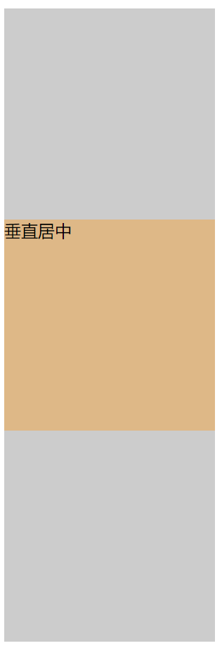
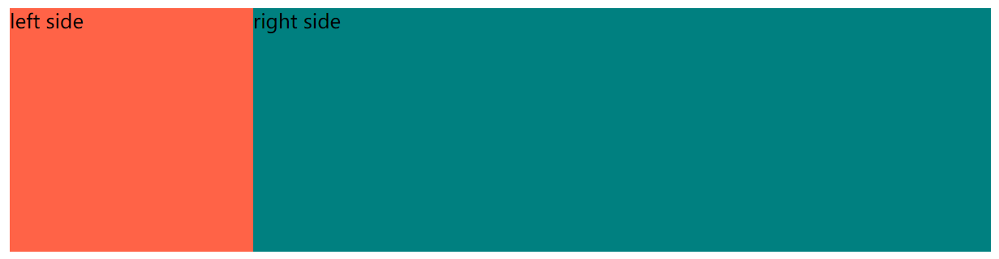

##### 什么是布局 ？

简单来说就是 html 页面的整体结构或者骨架，类似于传统的报纸或者杂志中的排版。

布局不是某个具体的技术内容，而是一种设计思想。


##### 什么是居中布局

- 元素在页面中呈现居中效果
  - 水平居中，元素距离页面左端和右端的水平距离完全相同
  - 垂直居中，元素距离页面上部和下部的垂直距离完全相同
- 分类
  - 水平居中布局
  - 垂直居中布局
  - 居中布局（水平 + 垂直）


##### 水平居中布局

- 水平居中布局就是指当前元素在父级元素容器中，水平方向是居中显示的（废话）

- 实现方式

  - inline-block +text-align 属性配合使用

    - 优点，浏览器兼容性好
    - 缺点，text-align 属性具有继承性，导致子元素的文本也是居中显示的

    ```css
    <!DOCTYPE html>
    <html lang="en">
    <head>
        <meta charset="UTF-8">
        <meta name="viewport" content="width=device-width, initial-scale=1.0">
        <title>水平居中布局</title>
        <style>
            .parent{
                width: 100%;
                height: 200px;
                background-color: #cccccc;
    
                text-align: center;
                /* text-align 是为文本内容设置对齐方式
                   left 左对齐
                   center 居中对齐
                   right 右对齐
                 */
            }
            .child{
                width: 200px;
                height: 200px;
                background-color:pink;
    
                /* display 属性
                block 块级元素
                inline 行内元素, width 和 height 属性无效, 所以必须是 inline-block 而不能是inline 
                (text-align属性对于行内元素有效)
                inline-block 行内块级元素, width height 有效(块级+内联) */
    
                display: inline-block;
                text-align: left;
                /* 设置子元素的对其方式，默认会继承上一级的 text-align:center */
                
            }
        </style>
    </head>
    <body>
        <div class="parent">
            <div class="child">
                文本
            </div>
        </div>
    </body>
    </html>
    ```

    

    

  - table + margin 属性配合使用

    - 父元素只需设置宽高，背景色即可。
    - 优点，只需要对子级元素设置就可以实现水平方向的居中效果。
    - 缺点，如果子级元素脱离文档流，会导致 margin 属性值无效。
      - 脱离文档流的方式
        - float  （浮动）
        - absolute （绝对定位）
        - fixed (固定定位)

    ```css
    	.child{
                display: table;
                /* display: block; */
                /* display: inline; */
                /* table 和 block 都可以，但是inline 不行，无法设置宽度 */
                margin: 0 auto;
    
                /* margin属性, 外边距 
                一个值，表示上下左右
                两个值，第一个表示上下，第二个表示左右
                三个值，第一个表示上，第二个表示左右，第三个表示下
                四个值，表示上右下左
                margin: 0 auto 表示上下边距为 0, 左右边距为 auto
                ,即浏览器自动等分。
                */
    
                width: 200px;
                height: 200px;
                background-color: blue;
    
            }
    ```

    

    

  - absolute + transform 属性配合使用
  
    - 优点： 父级元素是否脱离文档流（父级元素 position 为 absolute 和 fixed 的时候已经脱离文档流了），不影响子元素水平居中效果。
    - 缺点： transform 属性是 css3中新增属性，浏览器支持情况不好
  
    ```css
    <!DOCTYPE html>
    <html lang="en">
    <head>
        <meta charset="UTF-8">
        <meta name="viewport" content="width=device-width, initial-scale=1.0">
        <title>水平居中布局</title>
        <style>
            .parent{ 
                width: 100%;
                height: 200px;
                background-color: #cccccc;
    
                /* 第三种方案，需要父容器开启定位，absolute fixed relative 任何一个值都可以开启定位,
                只有 position 默认值 static 表示不开启定位*/
                position: relative;
            }
            
    
            /* 第三种解决方案 absolute + transform*/
    
    
            .child{
                
                position: absolute;
                /* 当前元素设置为绝对定位之后，如果父级元素没有开启定位的话，当前元素相对于页面定位，否认这相对于父级元素开启定位。
                 */
                width: 300px;
                height: 200px;
                background-color: tomato;
                left: 50%;
                /* 子元素的左侧距离父元素左侧 50% 距离 */
                transform: translateX(-50%);
                /* 子元素向左移动自身宽度的一半 */
            }
        </style>
    </head>
    <body>
        <div class="parent">
            <div class="child">
                文本
            </div>
        </div>
    </body>
    </html>
    ```
  
    
  
    

----

##### 垂直居中布局

- 垂直居中布局就是指当前元素在父级容器中，垂直方向是居中显示的。（好傻啊）

- 垂直居中布局实现方式

  - table-cell + vertical-align 属性配合使用

  - 优点， 浏览器兼容性更好

  - 缺点，vertical-align属性具有继承性，导致父级元素的文本也是居中显示的

    ```css
    	.parent{
                width: 200px;
                height: 600px;
                background-color: #cccccc;
    
                /* 方案一 父容器设定 display 和 vertical-align 子元素无需其他样式 */
                display: table-cell;
                /* 
                 * display 属性
                 * table: 设置当前元素为<table> 元素
                 * table-cell 设置当前元素为 <td> 元素，即单元格
                 */
                /* vertical-align 属性： 用于设置文本内容的垂直方向对其方式
                top: 顶部对齐
                middle: 居中对齐
                bottom: 底部对齐
                */
                vertical-align: middle;
    
                /* 方案二需要父容器设定定位 */
                /* position: relative; */
    
            }
    
             .child{
                width: 200px;
                height: 200px;
                background-color: burlywood;
    
            }
    ```

    

    

  - absolute + transform 属性配合使用

  - 优点，无论父级元素是否脱离文档流，都不影响子元素垂直居中效果。

  - 缺点，transform 属性是 css3 新增属性，浏览器支持情况不是很好。

    ```css
    <!DOCTYPE html>
    <html lang="en">
    <head>
        <meta charset="UTF-8">
        <meta name="viewport" content="width=device-width, initial-scale=1.0">
        <title>垂直居中</title>
        <style>
            .parent{
                width: 200px;
                height: 600px;
                background-color: #cccccc;
    
                position: relative;
            }
            .child{
                width: 200px;
                height: 200px;
                background-color: brown;
    
                position: absolute;
                top: 50%;
                transform: translateY(-50%);
            }
        </style>
    </head>
    <body>
        <div class="parent">
            <div class="child">
                垂直居中
            </div>
        </div>
    </body>
    </html>
    ```

    

    


##### 居中布局

- 居中布局就是水平方向居中 + 垂直方向居中。

- 解决方案

  - table + margin 实现水平居中，table-cell + vertical-align 的方式实现垂直居中

  - 缺点，td 包含了 table, 不符合html语义化的规则，可以将 display : table 改为 block, 在父子组件中都有 比较多的 CSS 语句。

  - 优点，浏览器兼容性好。

    ```css
    	.parent{
                width: 600px;
                height: 400px;
                background-color: #cccccc;
    
                /* 解决方案按 使用 table-cell + verticalAlign 垂直居中，table + margin 水平居中 */
    
                display: table-cell;
                /* <td> */
                vertical-align: middle;
            }
            .child{
                width: 200px;
                height: 200px;
                background-color: brown;
    
                display: block; 
                /* <table> */
                /* display: table; */
                margin: 0 auto;
            }
    ```

    

    

  - absolute + transform 实现水平方向和垂直方向居中

    - 缺点， 父级容器需要定位（修改父级容器css），transform 是 css3 的属性，浏览器兼容性没那么好。

    ```css
    	.parent{
                width: 600px;
                height: 400px;
                background-color: #cccccc;
    
                /* 解决方案一 absolute + transform */
                /* 父元素设置一个定位 */
                position: relative;
            }
            .child{
                width: 200px;
                height: 200px;
                background-color: tomato;
    
                position: absolute;
                top: 50%;
                left: 50%;
                transform: translate(-50%, -50%);
            }
    ```

    

    

  ----

  ##### 多列布局

  - 多列布局即几个元素呈现水平方式排列的效果。块级元素默认独占一行，可设置浮动让其一行排列。行内元素和行内块都是不独占一行的。

  - 分类

    - 两列布局（一列定宽，一列自适应）
    - 三列布局（两列定宽，一列自适应）
    - 圣杯布局和双飞翼布局
    - 等分布局 （一行内各个元素宽度相等）
    - 等高布局 
    - css3 多列布局

  - 两列布局

    - 一般情况下指的是定宽和自适应布局，两列中左列是确定的宽度，右列是自动填充剩余所有空间的一种布局效果。

    - 实现方式

      - float + margin 属性实现

        - 优点，实现方式简单。

        - 缺点：自适应元素margin属性值与定宽元素的 width 属性值需要保持一致。定宽元素浮动与自适应元素不浮动导致浏览器兼容性不好。自适应元素的子元素使用 `clear:both` 的情况下会破坏布局。

          ```css
                  .parent1{
                      width: 100%;
                      height: 200px;
                      background-color: #cccccc;
                  }
                  .left1{
                      width: 200px;
                      height: 100%;
                      background-color: brown;
          
                      /* 当前元素脱离文档流 */
                      float: left;
                  }
                  .right1{
                      height: 100%;
                      background-color: tomato;
                      
                      margin-left: 200px;
                  }
          
          	<div class="parent1">
                  <div class="left1">
                      左侧定宽
                  </div>
                  <div class="right1">
                      右侧自适应
                  </div>
              </div>
          ```

        

      - 改进型 float + margin 的实现

        - 优点：1）两个元素都浮动，兼容性更好。2）右侧子元素设置 clear: both 也问题了。

        - 缺点：1）实现复杂，2）数值耦合。
      
          ```css
          	<div class="parent2">
                  <div class="left2">
                      左侧定宽
                  </div>
                  <div class="right-fix">
                      <div class="right2">
                          <div class="inner">
                              右侧自适应，子元素添加 clear:both 也不怕
                          </div>
                      </div>
                  </div>
              </div>
          
          		.parent2 {
                      margin-top: 20px;
                      width: 100%;
                      height: 200px;
                      background-color: #cccccc;
                  }
          
                  .left2 {
                      width: 200px;
                      height: 100%;
                      background-color: tomato;
          
                      float: left;
                      position: relative;
                  }
          
                  .right-fix {
                      background-color: teal;
                      /* 设置浮动之后，宽度不是父级元素的100%而是由子元素宽度之和决定 */
                      float: right;
                      /* width: calc(100% - 200px); */
                      /* 通过 css3 calc 计算宽度的话就不需要负的margin了，left2也不用通过 position: relative 增加显示层级了 */
                      height: 100%;
                      /* 通过负的margin移动到上一列 */
                      margin-left: -200px;
                      width: 100%;
                  }
          
                  .right2 {
                      background-color: violet;
                      height: 100%;
                      margin-left: 200px;
                  }
                  .inner{
                      clear: both;
                      background-color: royalblue;
                      height: 200px;
            }
          ```

      
  
  - float + overflow 属性配合实现
  
    - 优点， 简单易用
  - 缺点，overflow 属性不仅解决了两列布局问题，同时设置了内容溢出的情况。单个 float 的浏览器兼容性。
    
    ```css
        	.parent {
                    width: 100%;
                    height: 200px;
                    background-color: #cccccc;
                }
        
                .left {
                    background-color: tomato;
                    width: 200px;
                    height: 200px;
                    float: left;
                }
        
                .right {
                    background-color: teal;
                    /* 开启BFC模式，当前元素的内部环境和外界完全隔离 */
                    overflow: hidden;
                    /* 或者 */
                    /* margin-left: 200px; */
                    height: 200px;
                }
        
         	<div class="parent">
                <div class="left">left side</div>
                <div class="right">right side</div>
            </div>
    ```
    
    
  
  
  
  - display + table 
  
    - 优点， 浏览器兼容性比价好。
  
    - 缺点，display: table, table 会带来制约。单元格的宽度会默认分配，表格本身的属性会影响布局。
  
      ```css
      		.parent{
                  width: 100%;
                  height: 200px;
                  background-color: #cccccc;
      
                  /* 表格单元格宽度自动分配，默认平分，一侧固定宽度，一侧占有剩余全部 */
                  display: table;
                  /* 列宽由表格宽度和列宽度决定 */
                  table-layout: fixed;
                  /* https://www.runoob.com/cssref/pr-tab-table-layout.html */
              }
              .left, .right{
                  height: 200px;
                  background-color: tomato;
      
                  display: table-cell;
              }
              .left{
                  background-color: teal;
      
                  width: 200px;
              }
      
      <div class="parent">
              <div class="left">
                  left table cell
              </div>
              <div class="right">
                  right table cell
              </div>
          </div>
      ```
  
      
  
    
  
    
  
    
  


