##### 三列布局

- 定义，一般情况下指的是左边两列是确定的宽度，右边一列是自动填充剩余所有空间的一种布局效果。

- 实现方式

  - float + margin 
  - float + overflow
  - display 属性的 table 相关值使用

  ```css
  	<style>
          .parent{
              width: 100%;
              height: 200px;
  
              display: table;
              /* 第三种解决方案需要使用一个div 包裹所有的子元素 */
          }
  
          .left, .center, .right{
              height: 200px;
              display: table-cell;
          }
  
          .left{
              /* 定宽 */
              width: 200px;
              background-color: #cccccc;
              /* float: left; */
  
          }
          .center{
              width: 300px;
              background-color: tomato;
              /* float: left; */
          }
          .right{
              background-color: teal;
  
              /* margin-left: 500px; */
              /* 第二种方案，左侧两个仍然是float */
              /* overflow:hidden 生成一个bfc 去除float 的影响 */
              /* overflow: hidden; */
  
          }
      </style>
  
  	<div class="parent">
          <div class="left">
              left
          </div>
          <div class="center">
              center
          </div>
          <div class="right">
              right
          </div>
      </div>
  ```

  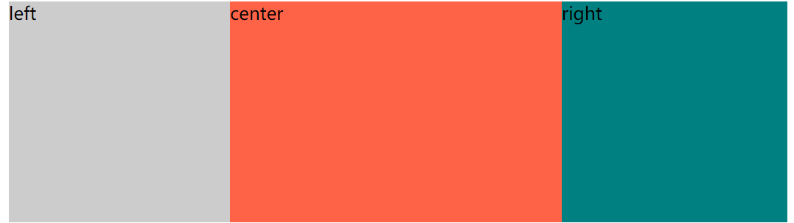


##### 圣杯布局

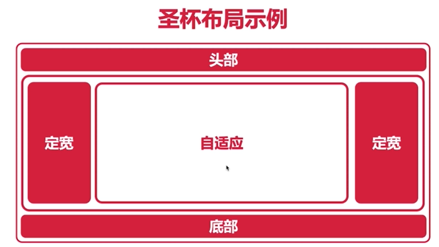

- 一般认为是三行三列布局，名称来源于该布局效果类似圣杯。三行就是三个 div, 难点就是三列，就是 定宽 + 自适应 + 定宽的实现。

- 圣杯布局主要是实现中间主体部分中的左右定宽 + 中间自适应的布局效果。

- 实现方式

  - margin + float

    - 优点，简单易用

    - 缺点，center 位于页面靠后的位置，搜索引擎在解析页面的时候需要比较多的时间才能解析到，不易于搜索引擎优化。

      ```css
      	<style>
              .parent{
                  width: 100%;
                  height: 200px;
              }
              .left, .right, .center{
                  height: 200px;
              }
      
              .left{
                  width: 200px;
                  background-color: #cccccc;
      
                  float: left;
              }
              .center{
                  background-color: tomato;
      
                  margin-left: 200px;
                  margin-right: 200px;
              }
              .right{
                  width: 200px;
                  background-color: teal;
      
                  float: right;
              }
          </style>
      
      <!-- right 位于 center 之前是因为，浮动的元素无法占据非浮动元素在一行中剩余的位置，而非浮动的元素则可以占据浮动的元素在一行中剩余的位置。如果按照 left, center, right的方式去做，right会保存在下一行 -->
      
          <div class="parent">
              <div class="left">
                  左侧定宽
              </div>
              <div class="right">
                  右侧定宽
              </div>
              <div class="center">
                  中间自适应
              </div>
          </div>
      ```

      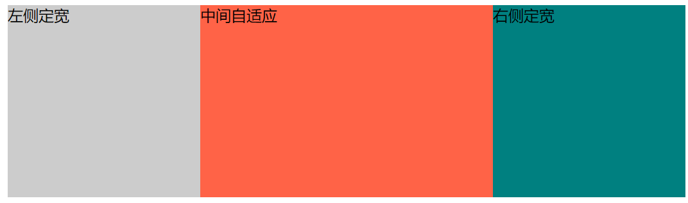

  - 三个元素全浮动，父容器margin 留出位置，定宽元素通过 margin负值和 定位移动到指定位置。

    - 优点

    - 缺点，总宽度过小时，

      ```css
      	.parent {
                  height: 200px;
                  width: auto;
                  /* 这里不要再写 width:100% 会出问题 */
                  /* 数值耦合，留出左右的位置 */
                  margin-left: 200px;
                  margin-right: 200px;
              }
      
              .left,
              .right,
              .center {
                  height: 200px;
                  float: left;
              }
      
              .center {
                  background-color: tomato;
                  width: 100%;
              }
      
              .left {
                  width: 200px;
                  background-color: #cccccc;
      
                  /* 移动到上一行 */
                  margin-left: -100%;
      
                  /*有 position 才可以使用定位，relative 不会脱离文档流，更容易控制*/
                  /* 移动到指定位置 */
                  position: relative;
                  left: -200px;
              }
      
              .right {
                  width: 200px;
                  background-color: teal;
      
                  margin-left: -200px;
                  position: relative;
                  /* right: -200px; */
                  left: 200px;
              }
      
      	<div class="parent">
              <!-- center 位于最前，加速解析，有利于seo -->
              <div class="center">
                  中间自适应
              </div>
              <div class="left">
                  左侧定宽
              </div>
              <div class="right">
                  右侧定宽
              </div>
          </div>
      ```

      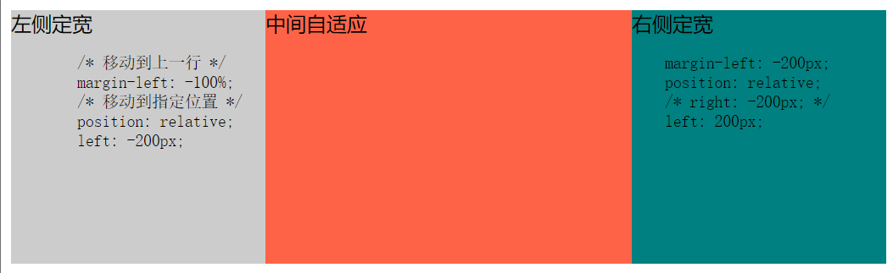

  ##### 双飞翼布局

  - 定义，双飞翼布局最早由淘宝团队提出，是针对圣杯布局的优化解决方案，主要是优化了圣杯布局中开启定位的问题。

  - 优点，解决了圣杯布局中开启 定位的问题

    ```css
    	.parent{
                height: 200px;
            }
    
            .left, .center, .right{
                float: left;
                height: 200px;
            }
    
            .center{
                width: 100%;
                background-color:cornflowerblue;
            }
    
            .inner{
                height: 200px;
                background-color: teal;
    
                margin:0 200px;
            }
    
            .left{
                width: 200px;
                background-color: #cccccc;
    
                margin-left: -100%;
            }
    
            .right{
                width: 200px;
                background-color: tomato;
    
                margin-left: -200px;
               
            }
    
    
    	<div class="parent">
            <div class="center">
                <div class="inner">
                    parent 内有
                    center 浮动 内有
                    inner 左右外边距
                    
                </div>
            </div>
            <div class="left">
                左侧定宽，浮动，负外边距
            </div>
            <div class="right">
                右侧定宽，浮动，负外边距
            </div>
        </div>
    ```

    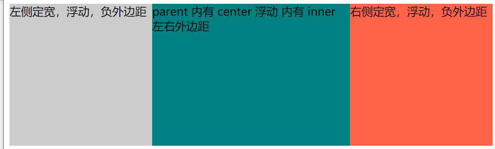

    

##### 等分布局

- 定义，等分布局就是一行被分成若干列，每一列的宽度一致

- 实现方式

  - float 

    ```css
    	.parent{
                height: 200px;
                background-color: #cccccc;
            }
            .column1, .column2, .column3, .column4{
                height: 100%;
                width: 25%;
                float: left;
            }
            .column1{
                background-color: tomato;
                /* 实际开发颜色最好不用单词，不同浏览器之间可能有差异 */
            }
            .column2{
                background-color: brown;
            }
            .column3{
                background-color: cadetblue;
            }
            .column4{
                background-color: teal;
            }
    
    	<div class="parent">
            <div class="column1">1</div>
            <div class="column2">2</div>
            <div class="column3">3</div>
            <div class="column4">4</div>
        </div>
    ```

    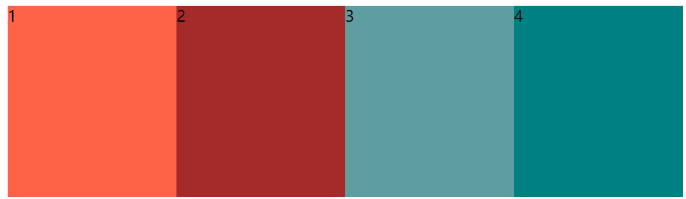

    

  - display 以及 table

    ```css
    	.parent{
                /* 注意表格额宽度如果不写要有单元格宽度之和决定 */
                width: 100%;
                /* table */
                display: table;
    
                height: 200px;
            }
    
            .column1, .column2, .column3, .column4{
                /* table cell 自动等分 */
                display: table-cell;
                height: 200px;
            } 
            .column1{
                background-color: tomato;
            }
            .column2{
                background-color: #ccc;
            }
            .column3{
                background-color: brown;
            }
            .column4{
                background-color: teal;
            }
    
    	<div class="parent">
            <div class="column1">column1</div>
            <div class="column2">column2</div>
            <div class="column3">column3</div>
            <div class="column4">column4</div>
        </div>
    ```

- 等分布局存在间距的问题

  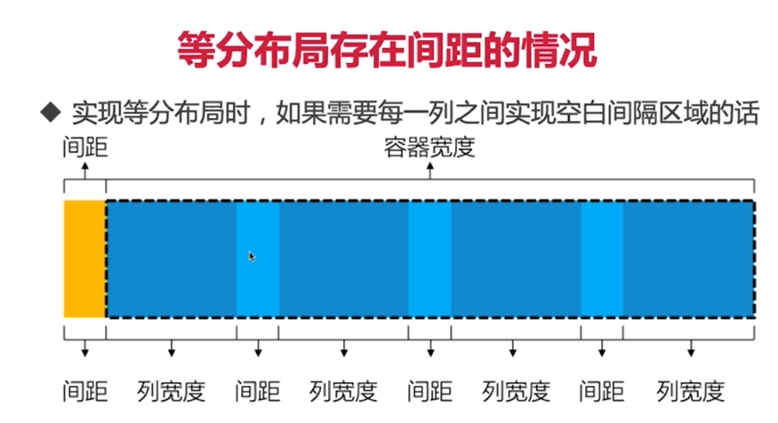

  公式： 间距 + 容器宽度 = （间距 + 列宽度）*  N

  (套路，当现有页面布局无法解决问题的时候，增加父级容器或子级元素)

  - 通过 负 margin 消除 多余间隙，box-sizing 实现带间距的等分

    ```css
    	.parent-wrapper{
                margin-left: -20px;
                overflow: hidden;
            }
            .parent {
                /* 子元素浮动之后为了防止高度塌陷设置高度 */
                height: 200px;
            }
            .column1,
            .column2,
            .column3,
            .column4 {
                height: 100%;
                width: 25%;
                float: left;
                padding-left: 20px;
    
                box-sizing: border-box;
            }
    
            .inner{
                height: 200px;
            }
    
            .column1 .inner {
                background-color: tomato;
            /* 实际开发颜色最好不用单词，不同浏览器之间可能有差异 */
            }
    
            .column2 .inner{
                background-color: brown;
            }
    
            .column3 .inner{
                background-color: cadetblue;
            }
    
            .column4 .inner{
                background-color: teal;
            }
    
    	<div class="parent-wrapper">
            <div class="parent">
                <div class="column1">
                    <div class="inner"></div>
                </div>
                <div class="column2">
                    <div class="inner"></div>
                </div>
                <div class="column3">
                    <div class="inner"></div>
                </div>
                <div class="column4">
                    <div class="inner"></div>
                </div>
            </div>
        </div>
    ```

    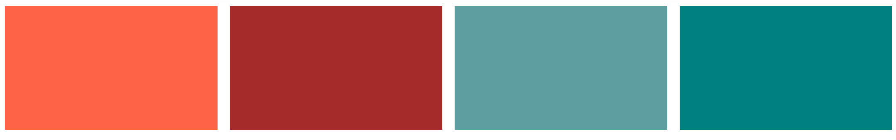

  - 通过 负的 margin 和 padding 在表格布局中实现 带边距的等分布局

    ```css
    	.parent-wrapper {
                margin-left: -20px;
            }
    
            .parent {
                /* 注意表格额宽度如果不写要有单元格宽度之和决定 */
                width: 100%;
                display: table;
    
                height: 200px;
            }
    
            .column1,
            .column2,
            .column3,
            .column4 {
                /* table cell 自动等分 */
                display: table-cell;
                padding-left: 20px;
                height: 200px;
            }
    
            .inner {
                height: 200px;
            }
    
            .column1 .inner {
                background-color: tomato;
            }
    
            .column2 .inner {
                background-color: #ccc;
            }
    
            .column3 .inner {
                background-color: brown;
            }
    
            .column4 .inner {
                background-color: teal;
            }
    
    	<div class="parent-wrapper">
            <div class="parent">
                <div class="column1">
                    <div class="inner"></div>
                </div>
                <div class="column2">
                    <div class="inner"></div>
                </div>
                <div class="column3">
                    <div class="inner"></div>
                </div>
                <div class="column4">
                    <div class="inner"></div>
                </div>
            </div>
        </div>
    ```

    

---

##### 等高布局

- 定义，一行划分为若干列，每一列的高度都是相同的值。

- 实现方式

  - display 属性中 table 值实现等高布局

    ```css
    	.parent{
                /* 表格中的单元格默认等高，浏览器兼容性好 */
                display: table;
            }
            .left, .right{
                width: 300px;
                display: table-cell;
            }
            .left{
                background-color: tomato;
            }
            .right{
                background-color: teal;
            }
    
    	<div class="parent">
            <div class="left">left side</div>
            <div class="right">
                Lorem ipsum dolor sit amet consectetur adipisicing elit. Natus qui nihil, quo nulla consequuntur veniam maiores et ad repellendus numquam in pariatur ducimus molestiae dolor dolore. Exercitationem autem aliquid explicabo!
            </div>
        </div>
    ```

    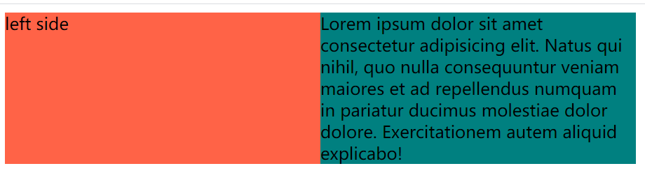

    

  - padding + margin 属性实现等高布局效果。仅仅是视觉上的等高，但并不是真正的布局结构。

    ```css
    	  .parent{
                overflow: hidden;
            }
            .left, .right{
                width: 300px;
                float: left;
    
                padding-bottom: 9999px;
                /* 向上移动 */
                margin-bottom: -9999px;
            }
            .left{
                background-color: tomato;
            }
            .right{
                background-color: teal;
            }
    
    	<div class="parent">
            <div class="left">
                left is left
            </div>
            <div class="right">
                Lorem ipsum dolor sit, amet consectetur adipisicing elit. Iusto, rerum. Commodi in aspernatur asperiores reiciendis ipsum ex voluptas amet sequi. Voluptate nulla laborum molestias placeat natus officiis animi officia quas.
            </div>
        </div>
    ```

    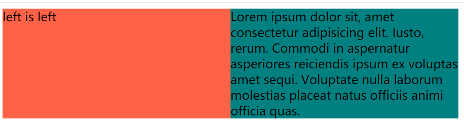

----

##### CSS3 多列布局

- columns 属性，一个简写属性

  - column-count 属性: 定义列的数量，或者允许的最大列数

    - auto, 默认值，表示列的数量又其他 CSS 属性决定
    - number, 必须是整数，用于表示定义列的数量

  - column-width 属性: 定义列的宽度

    - auto, 默认值，由 CSS 属性决定
    - length, 必须是整数

    ```css
    .parent{
                height: 300px;
                background-color: #cccccc;
                /* column-count: 4;
                column-width: 300px; */
                columns: 4 300px;
            }
            .column1, .column2, .column3, .column4{
                /* width: 300px; */
                height: 300px;
            }
            .column1{
                background-color: tomato;
            }
            .column2{
                background-color: brown;
            }
            .column3{
                background-color: cadetblue;
            }
            .column4{
                background-color: teal;
            }
    
    	<div class="parent">
            <div class="column1"></div>
            <div class="column2"></div>
            <div class="column3"></div>
            <div class="column4"></div>        
        </div>
    ```

    

  - column-gap 属性设置 列与列之间的间距，该属性需要为多列显示时的元素设置。

    - normal: 用于表示浏览器定义列的默认间距
    - length: 必须是正整数，表示定义列之间的间距

  - column-rule 属性定义列与列之间的边框，包括边框宽度，边框颜色以及边框样式。

    - column-rule-width 边框宽度
    - column-rule-color 边框颜色
    - column-rule-style 边框样式

  - 横跨多列  column-span 定义一个列元素是否跨列

    - none: 不横跨列
    - all: 跨所有列

  - 列的填充 , column-fill 属性用于定义列的高度是由内容决定还是统一高度

    - auto， 默认值，列的高度由北荣决定
    - balance, 列的高度根据内容最多的一列高度为准

    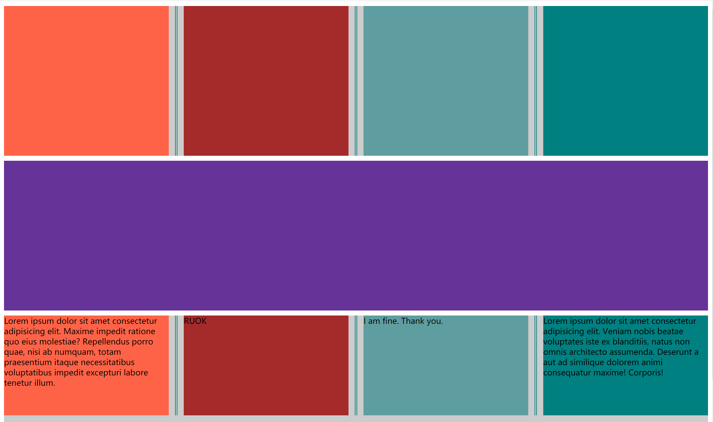

    

----

##### 全屏布局

- 定义，全屏布局指 html 页面铺满整个浏览器窗口，并且没有滚动条，而且还可以跟随浏览器的大小变化而变化。

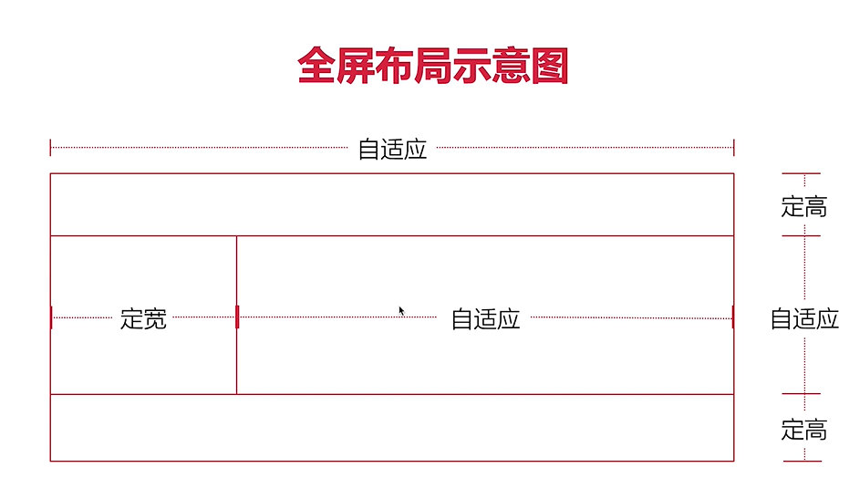

```css
	/* 去除默认样式 */
        html,
        body {
            margin: 0;
            overflow: hidden;
        }

        header {
            /* 默认宽度为父元素宽度 100% */
            height: 100px;
            background-color: tomato;
            /* 定位到最上方 */
            position: fixed;
            top: 0;
            left: 0;
            right: 0;
        }

        footer {
            height: 100px;
            background-color: brown;
            position: fixed;
            bottom: 0;
            left: 0;
            right: 0;
        }

        .content {
            position: fixed;
            top: 100px;
            bottom: 100px;
            left: 0;
            right: 0;
            background-color: #cccccc;
        }

        .left {
            width: 200px;
            height: 100%;
            float: left;
            background-color: cyan;
        }

        .right {
            height: 100%;
            margin-left: 200px;
            /* width: cala(100% - 200px); */
            background-color: #cccccc;
            overflow: auto;
        }

	<header></header>
    <div class="content">
        <div class="left"></div>
        <div class="right">
            <div class="text-box">
                <p>
                    Hello World
                </p>
            </div>
        </div>
    </div>
    <footer></footer>
```

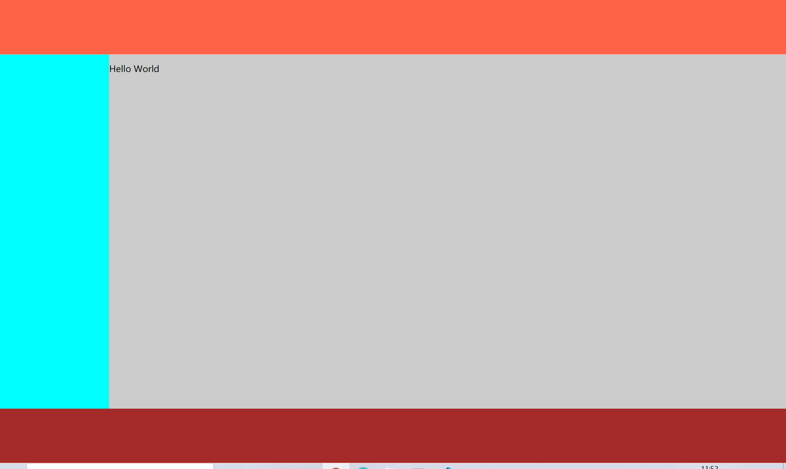


----

总结

- 居中布局
- 多列布局
  - 两列布局
  - 三列布局
    - 圣杯布局
    - 双飞翼布局
- 全屏布局
- 未涉及到的内容
  - 网格布局 Grid
  - 弹性盒子布局 Flex

