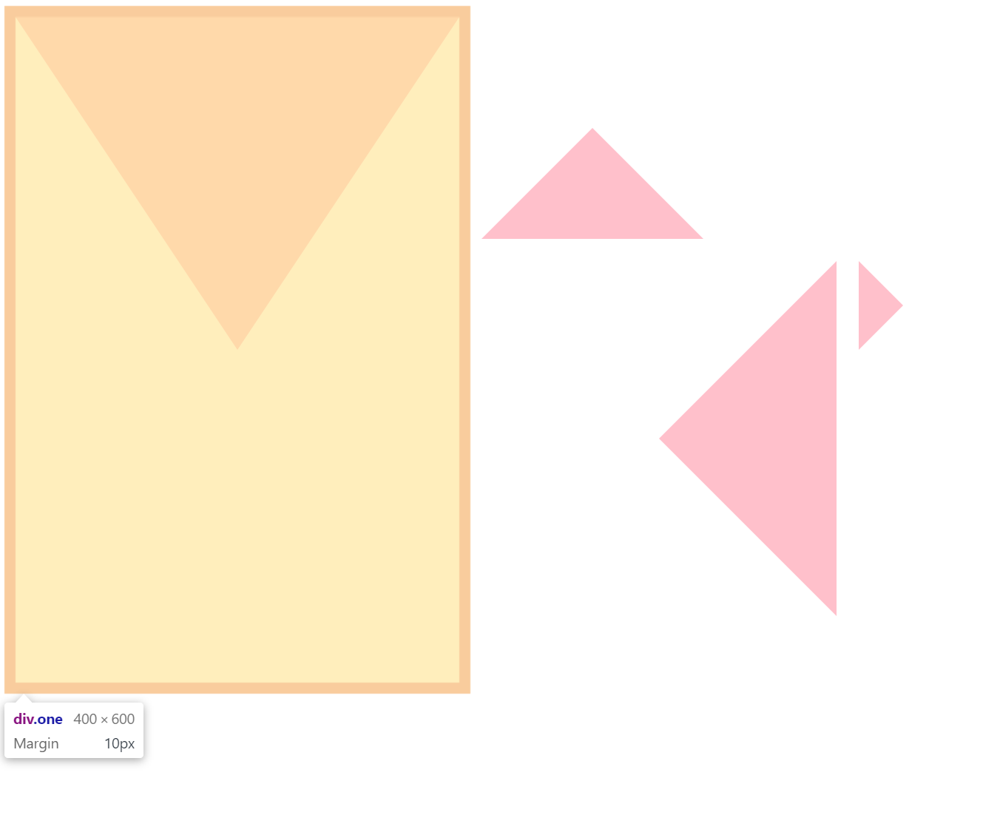

---

## 盒模型中的border 

在盒模型中，当 border 有一定宽度时，border  + content 构成了一个矩形，content 本身也是一个矩形，此时，4条边的border  其实是等边梯形。当设置content 的宽度和高度都是 0  的时候，border  宽度不为零，这时border 就退化成了四个等腰子三角形。而实现三角形的原理正是基于此，将四个三角形中的三个设置为 透明，另一个填充颜色，就得到了一个三角形。

----

### 具体代码为

注意 css 中 border-width 传入的两个参数就是四个三角形组成的矩形的宽和高。

```css
.one,.two,.three,.four{
            width: 0px;
            height: 0px;
            float: left;
            margin: 10px;
        }
        .one {
            border-style: solid;
            border-width: 300px  200px;
            border-color:  pink transparent transparent transparent;
        }
        .two {
            border: 100px  solid;
            border-color: transparent  transparent pink transparent;
        }
        .three {
            border-width: 160px 160px; 
            border-style: solid;
            border-color: transparent pink transparent transparent;            
        }
        .four {
           
            border-style: solid;
            border-width: 40px 40px;
            border-color: transparent transparent transparent pink;
        }
```

----


### 实际效果为




---

参考文献：

- [css三角形的实现和原理]( http://caibaojian.com/css-border-triangle.html )