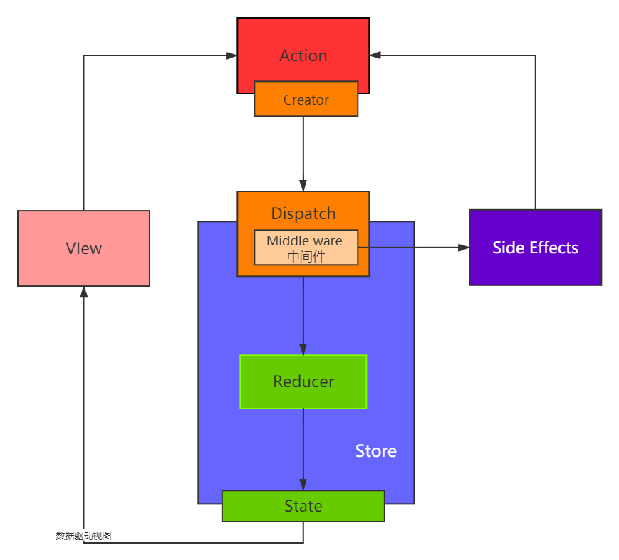

---

1. 组件之间如何通信

   - 父子组件 props 传值，传函数，函数调用传参数
   - 自定义事件
   - Redux 和 Context

2. JSX 本质是什么

   - createElement
   - 执行返回 vnode

3. context 是什么，如何应用

   - 父组件向旗下所有子孙组件传递信息
   - 如简单个公共信息，主题色，语言等
   - 复杂的公共信息用redux

4. shouldComponentUpdate 的用途

   - 性能优化
   - 配合 不可变值 一起使用，否则可能出现 数据更新视图不更新的 bug

5. redux 单项数据流

   

6. setState 场景题

   ```jsx
   componentDitMount(){
       // this.state.count 初始值为 0
       this.setState({count: this.state.count+1});
       console.log("1", this.state.count);
       this.setState({count: this.state.count+1});
       console.log("1", this.state.count);
       // 上面两个setState 操作都是异步的, 而且会被合并, 打印结果都是 0，count 加一
       setTimeOut(()=>{
           this.setState({count: this.state.count+1});
       	console.log("1", this.state.count);    
       }, 0);
       setTimeOut(()=>{
           this.setState({count: this.state.count+1});
       	console.log("1", this.state.count);
       }, 0);
       // 上面两个在setTimeOut 中的setState 都是同步的, 也不会被合并, 输出分别是 2 和 3
   }
   ```

7. 什么是纯函数

   - 返回一个新值，没有副作用，不会 “偷偷” 修改其他值
   - 不可变值，如 arr1 = arr.slice()
   - 输入和返回应当是同种数据类型

8. React 组件生命周期

   - 单个组件生命周期
   - 父子组件生命周期
   - 注意 SCU 

9. React 发起 ajax 请求应该放在哪个生命周期上 ？

   - 和 VUE 一样，放到一个 DOM 已经渲染完毕的生命周期
   - componentDIdMount

10. 列表渲染为何用key

    - 必须有 key，且不能是 index 和 random ，应该是实际业务数据的唯一 ID

    - diff 算法中通过 key 和 tag 来判断是否 是 sameNode，是的话就不用更新

    - 减少渲染次数，提高渲染性能

      

11. 函数组件和class 组件的区别

    - 函数组件是纯函数的形式，输入props 输出 JSX  (createElement)
    - 没有实例，没好友生命周期，没有 state
    - 不能扩展其他方法

12. 什么是受控组件

    - 表单的值受到 state 控制，
    - 自行监听 onChange 更新 state

13. 何时使用异步组件 （同 Vue）

    - 加载大组件
    - 路由懒加载 （React.lazy 以及 React.suspense）

14. 多个组件的公共逻辑如何抽离

    - 高阶组件
    - Render props
    - mixin (已被废弃)

15. Redux 如何进行异步请求 (同步 action 直接返回一个 action 对象，异步action 要在异步中 dispatch 一个 action )

    - 使用 异步 action 
    - 使用插件，如 redux-saga, redux-thunk

16. react router 如何配置懒加载

    - 配合 lazy suspense 
    - 以及 通过箭头函数 import  的方法

17. PureComponent 与普通组件的区别

    - 实现了一个 渐层比较 state  的 shouldComponentUpdate 
    - 可以性能优化
    - 结合不可变值使用

18. React 和 DOM 事件的区别

    - 所有事件都挂在到 DOM 上
    - event 不是原生的， 是 SyntheticEvent 合成事件对象，原生 event 保存在 nativeEvent 中
    - dispatchEvent 机制

19. React 性能优化

    - 渲染列表时使用 key
    - 自定义事件， DOM 事件，定时器及时销毁 （componentDidUnMount）
    - 合理使用异步组件
    - 减少 bind this  次数
    - 合理使用 SCU PureComponent 和 memo
    - 合理使用 Immutable.js 
    - webpack 层面的优化
    - 前端通用的性能优化，图片懒加载等
    - SSR 服务端渲染

20. React 和 Vue 的异同点

    - 都支持组件化
    - 都支持数据驱动视图
    - 都是用 vdom 操作

    - React  使用 JSX 拥抱 JS （写 React 就是在写 JS） ，Vue 使用模板 拥抱 HTML (模板，JS，样式)
    - React 函数式编程，Vue 声明式 编程 （对数据变化的监听和视图更新的方式都是不同的）
    - React 需要更多自力更生， Vue 把想要的都给你，比如说（SCU 自动化，还有 Vue 中的各种指令）

