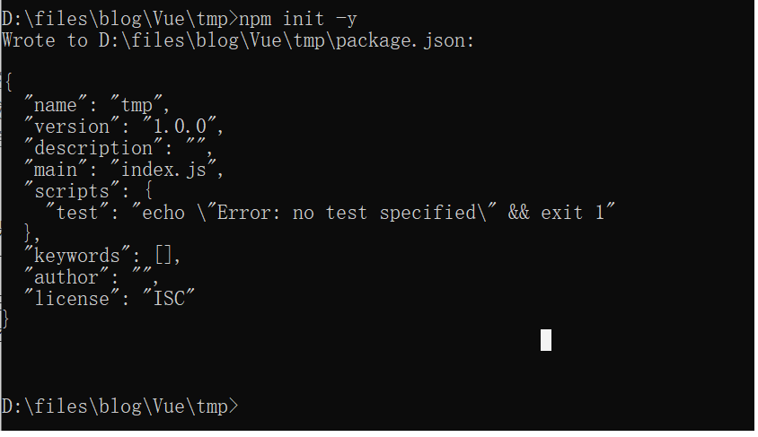
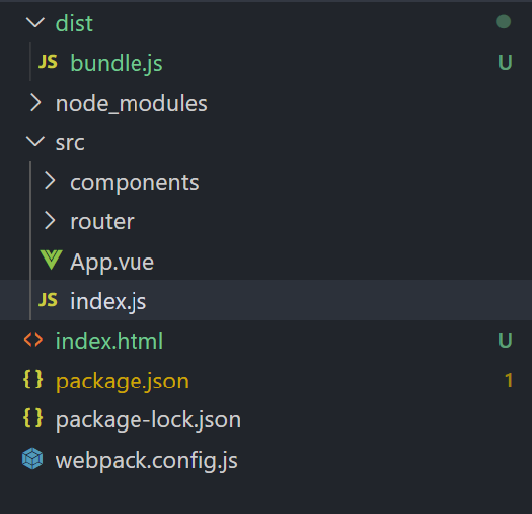
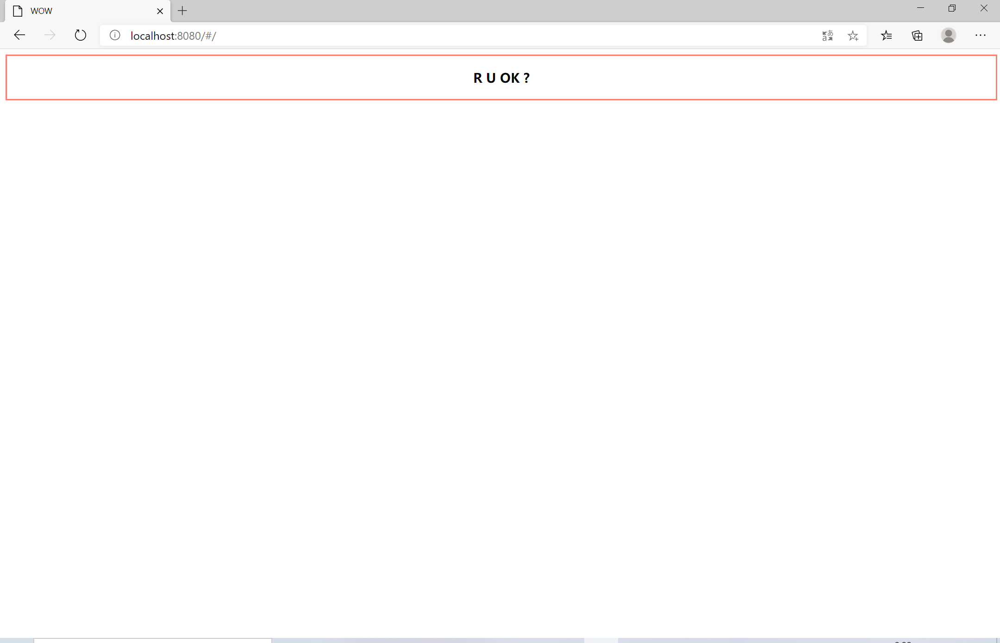

#### 从零开始构建一个 Vue 项目


   

##### 前言

​    

知其然还要知其所以然，很多时候我们不能仅仅停留在表面，而是要深入挖掘原理。只有掌握了原理才能更好的使用工具，才能批判地继承各种工具背后的解决方案的理念，才能在应用场景变化的时候轻松面对，才能有设计和创新。这是术和道的区别，也是码农和工程师的区别。

使用 Vue-Cli 可以快速，方便，轻松的创建项目，但是不利于大家深入理解 Vue 和 Webpack 以及 npm 这些 更为基础的工具。而这些工具在高级的前端项目中是必不可少的，是必须掌握的。所以，能不能从零开始，不借助 Vue-Cli 创建一个 Vue项目可以被看做一个前端工程师 是否入门的 一种标准。而从零开始构建一个Vue项目本身就是我们学习的过程。

从零开始，不借助 Vue-Cli 构建一个前端项目可以大致分为 3 个步骤。

- 使用 npm 初始化一个项目
- 编写 最基础的 Vue 代码
- 使用 webpack 启动项目

当然，在这三步之前需要你有一台已经安装了 nodejs，vscode, chrome浏览器等前端开发环境的电脑。


   

##### 使用 npm 初始化一个项目

​    

>  npm 为你和你的团队打开了连接整个 JavaScript 天才世界的一扇大门。它是世界上最大的软件注册表，每星期大约有 30 亿次的下载量，包含超过 600000 个 *包（package）* （即，代码模块）。来自各大洲的开源软件开发者使用 npm 互相分享和借鉴。包的结构使您能够轻松跟踪依赖项和版本。      -- npm 中文网。


npm 其实就是 nodejs package manager，就是 nodejs 的包管理工具，就像 Python 里面的 pip。因为十分好用，在浏览器端的开发中也十分常用。npm 在前端项目中承担着 包的安装，卸载，更新等功能。

好了，言归正传，使用 npm 初始化一个项目十分简单，`npm init -y` 即可。`npm init` 被用于在一个文件夹下初始化一个 前端项目，回车之后，在命令行中会以“对话”的形式询问你关于项目的各种信息。使用 `-y` 参数可以按照默认值直接创建项目，十分方便。

npm 初始化之后的得到的 package.json 内容如下。

```json
{
  "name": "tmp",
  "version": "1.0.0",
  "description": "",
  "main": "index.js",
  "scripts": {
    "test": "echo \"Error: no test specified\" && exit 1"
  },
  "keywords": [],
  "author": "",
  "license": "ISC"
}
```

命令行看起来是这样儿的。



​															图1 在命令行中运行 npm init -y 的结果 

##### 编写最基础的 Vue 代码

有了一个 package.json 之后，就可以开始编写最基础的Vue代码了。首先我们需要使用 npm 安装一下 vue 和 vue-router。vue-router 是 vue 全家桶（vue，vue-router, vuex 等等）中必不可少的一员，所以这里我们也用一下 vue-router。具体安装命令为：`npm install vue vue-router --save`

现在可以开始写代码了。 

- package.json 同级目录下 新建 一个 index.html， 内容如下。

  ```html
  <!DOCTYPE html>
  <html lang="en">
  <head>
      <meta charset="UTF-8">
      <meta name="viewport" content="width=device-width, initial-scale=1.0">
      <title>WOW</title>
  </head>
  <body>
      <div id="application"></div>
  </body>
  </html>
  ```

  其中 `<div id="application"></div>` 就是 整个 vue 实例的挂载点。

- package.json 同级目录下 新建 src 文件夹，src 文件夹下新建 index.js 和 App.vue ，内容如下。

  ```js
  // src/index.js
  
  import Vue from 'vue';
  import App from './App.vue';
  import router from './router';
  
  new Vue({
      el: '#application',
      router,
      render: h => h(App)
  });
  ```

  其中 router 是 路由文件，需要使用 vue-router，下面会给出具体代码。

  ```jsx
  // App.vue
  <template>
      <router-view></router-view>
  </template>
  <script>
  export default {
      name: 'App',
  }
  </script>
  ```

  App.vue 就是标准 的  vue文件的结构，先是 template，然后是 script，然后是 style。上面文件中省略了 style，而其中的`<router-view></router-view>` 正是 vue-router，具体的原理有待后续了解。

  

- 然后开始编写 路由。package.json 同级目录下新建 router 文件夹，router 文件夹下 新建 index.js，内容如下。

  ```js
  // router/index.js
  
  import Vue from 'vue';
  import Router from 'vue-router';
  import Main from "../components/main.vue";
  
  Vue.use(Router);
  
  export default new Router({
      routes: [
          {
              path: '/',
              name: 'main',
              component: Main,
          }
      ]
  });
  ```

  上面代码仅仅指定了一个路由，默认路径`/`下有 `Main` 组件 响应，而 `Main` 组件正是在 src/components/main.vue 中。

- 接上面一步，在src目录下新建文件夹 components，新建文件 main.vue，代码如下。

  ```jsx
  // src/components/main.vue
  
  <template>
      <div id="mainBox">
          <h3>R U OK ?</h3>
      </div>
  </template>
  
  <script>
  export default {
      data(){
          return{
  
          }
      }
  }
  </script>
  
  <style>
  #mainBox{
      width: 100%;
      height: 100%;
      margin: 0 auto;
      text-align: center;
      border: 2px solid salmon;
  }
  </style>
  ```

到这里，启动一个 vue 项目的代码已经编写完毕。目录结构如下所示。




 图2 一个从零开始配置的Vue项目的目录结构，其中 dist 文件夹为webpack打包结果，webpack.config.js为下一部分所要添加的内容。 


##### 使用 Webpack 启动项目

有了基本的代码，还需要借助 webpack 的力量通过打包构建让整个项目能够在浏览器中运行起来。关于webpack 的基本原理请参考[腾讯NEXT学院webpack教程]( https://www.bilibili.com/video/BV1a741197Hn?from=search&seid=296661155831463223 )，篇幅有限，这里就不展开了。

- 第一步是先安装相关的依赖。

  首先需要安装 webpack 和 webpack-cli 

```js
npm install webpack webpack-cli --save-dev
```

然后 webpack 还需要 vue-loader 以及  vue-template-compiler 才能处理 .vue 格式的文件

```js
npm install vue-loader vue-template-compiler --save
```

然后 webpack 还需要 css-loader 和 style-loader 才能处理 css 样式

```js
npm install css-loader style-loader --save-dev
```

最后，webpack 还需要 一个 html-webpack-plugin 的插件将 最终打包的 css 和 js 插入到 html 中。

```js
npm install html-webpack-plugin --save-dev
```

安装好这些插件以及loader 后，还需要写一个配置文件告诉webpack如何使用它们。在 package.json 同级目录下新建一个 webpack.config.js 文件，内容如下。

```js
const path = require('path');
const VueLoaderPlugin = require('vue-loader/lib/plugin')
const HtmlWebpackPlugin = require('html-webpack-plugin')

module.exports = {
    entry: path.join(__dirname, "\\src\\index.js"),
    output: {
        path: path.join(__dirname, "/dist"),
        filename: 'bundle.js'
    },
    module:{
        rules:[
            {
                test: /\.vue$/,
                include: /src/,
                use: {
                    loader: 'vue-loader',
                }
            },
            {
                test: /\.css$/,
                use: ['style-loader', 'css-loader']
            },
        ]
    },
    plugins:[
        new VueLoaderPlugin(),
        new HtmlWebpackPlugin({
            filename: 'index.html',
            template: 'index.html',
            inject: true,
        })
    ],
    mode: 'production',
    devServer:{
        quiet: true,
    }
}
```

最后，在 package.json 的 “scripts" 下添加命令，结果如下。

```js
 "scripts": {
    "test": "echo \"Error: no test specified\" && exit 1",
    "dev": "webpack-dev-server --config webpack.config.js --open --inline --progress"
  },
```

最后的最后，打开命令行，`npm run dev` ...





##### 参考文献

- [不借助Vue-Cli 初始化 Vue 项目](https://www.jianshu.com/p/635257fbb062)
- [webpack]( https://www.webpackjs.com/ )
- [npm]( https://www.npmjs.cn/ )
- [vue]( https://cn.vuejs.org/ )
- [腾讯NEXT学院webpack教程]( https://www.bilibili.com/video/BV1a741197Hn?from=search&seid=296661155831463223 )