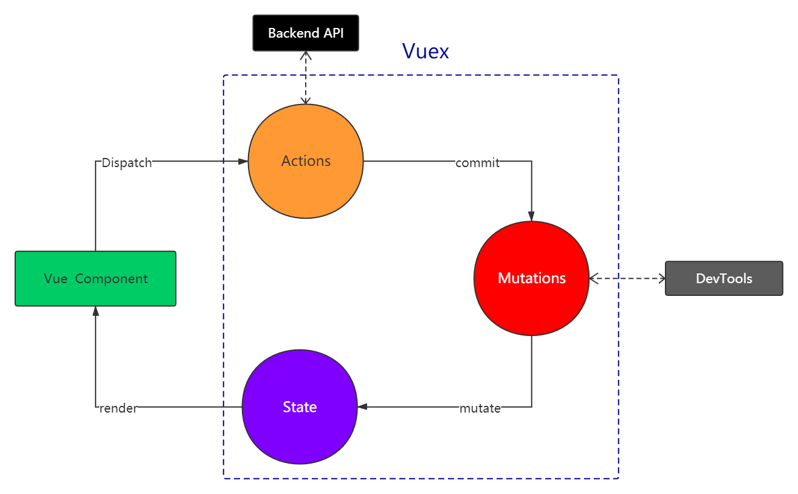

---
title:Vue的使用
---

#### Vue的使用


- vue-show 和 vue-if 的区别

- v-for 中为何要用 key

- vue 组件生命周期（有父子组件的情况）

- vue 组件间通信

- vue 组件渲染和更新的过程

- 双向数据绑定 v-model 的原理

     

##### 基本使用，组件化。（常用，必须会）

- 插值，表达式  

- 指令，动态属性

- v-html (有xss 风险，会覆盖子组件)

  ```vue
  <p>
      {{name}} 插值表达式
  </p>
  <p :id="dynamicID">
      动态属性
  </p>
  <p v-html="rawHtml">
      <span>有xss 风险</span>
      <span>使用 v-html 之后将会覆盖子元素，这里会被覆盖</span>
  </p>
  
  data(){
  	return {
  		dynamicId: `id-${Date.now()}`,
  		srawHtml: '原始html <b>粗体</b>',
    		name: '我是插值表达式',
  	}
  }
  ```

- computed 和 watch

  - computed 有缓存，data 不变的话不会重新计算
  - watch 默认是浅监听，监听引用类型拿不到 oldVal，深度监听需要些 deep: true

  ```jsx
  data(){
      return {
          nums: 20,
          info:{
              address: 'BEIJING',
          }
      }
  },
  computed:{
      double1(){
          return this.nums * 2
      },
          
      double2(){
          return this.nums2 * 2 * 2;
      }
  }
  watch:{
      name(oldVal, val){
          // 
      },
         
      info:{
          handler(oldVal, val){
              console.log("watch info", oldVal, val);
              // 注意 oldVla 和 val 都是指向同一个地址的，只是地址上的内容变化了，这里输出是看不到的。
          },
          deep: true,
          // 开启深度监听
      }
      
  }
  ```

- class 和 style

  - 使用动态属性
  - 使用驼峰式写法

  ```jsx
  <p :class="{black: isBlack, yellow: isYellow}"> 动态属性使用 class </p>
  <p :class="[black, yellow]"> 传入数组 使用 class </p>
  <p :style="styleData"> 使用 Style </p>
  
  data(){
      return{
          isBlack: true,
          isYellow: true,
          black: 'blackClass',
          yellow: 'yellowClass',
          
          styleData:{
              fontSize: '40px',
              color: 'red',
              backgroundColor: '#ccc'
              // 写成驼峰式
          }
      }
  }
  ```

- 条件渲染

  - v-if 和 v-else 的用法，可以使用变量也可以使用表达式

  - v-if 和 v-show 的区别 (v-if dom中只有单个节点，v-show则是多个dom节点通过 display:none 隐藏)

  - v-if 和 v-show 的使用场景

    如果选择是一次性的或者更新不频繁，建议使用 v-if 。 如果 变化频率高， 建议使用 v-show，减少dom操作

  ```jsx
  <div>
      <p v-if="type === 'a'">a v-if</p>
      <p v-else-if="type === 'A'">A v-if</p>
      <p v-else>other v-if</p>
      
      <p v-show="type === 'a'">a v-show</p>
      <p v-show="type === 'A'">A v-show</p>
  </div>
  ```

- 循环（列表）渲染

  - 如何遍历对象 ，可以用 v-for

  ```jsx
  <ul>
    <li v-for="(item, index) in listArr" :key="item.id">
    </li>
  </ul>
  <ul>
    <li v-for="(val, key,index) in obj" :key="key">
    </li>
  </ul>
  
  
  
  data(){
      return{
          listArr: [
              {id : "a", title: 'title1'},
              {id : "b", title: 'title2'},
              {id : "c", title: 'title3'},
          ],
          obj: {
              a: {title: 'titleOne'},
              b: {title: 'titleTwo'},
              c: {title: 'titleThree'},
          }
      }
  }
  ```

  - key 的重要性，key 必须写而且是特定的值
  - v-for 和 v-if 不能一起使用，v-for 的优先级更高，会计算出多个 li，然后多个重复的 if 判断，可以直接将 if 放置在高一层的 dom 中。或者确定的把 v-if 放在更深一层的dom中。

  ```jsx
  <ul>
    <li v-if="flag" v-for="(item, index) in listArr" :key="item.id">
    </li>
  </ul>
  
  data(){
      return{
          listArr: [
              {id : "a", title: 'title1'},
              {id : "b", title: 'title2'},
              {id : "c", title: 'title3'},
          ],
         flag: false,
      }
  }
  ```

  

- 事件

  - event 事件，自定义参数

  ```jsx
  <p>{{num}}</p>
  <button @click="addOne">+1</button>
  
  <button @click="addTwo(2, $event)">+2</button>
  
  data(){
      return{
          num:0,
      }
  }
  
  methods:{
      //绑定事件监听函数，不传参数的时候，直接可以接收event
      addOne(event){
          console.log("event", event, event.__proto__.constructor);
          // 原生的 mouseEvent 
          console.log(event.target);
          // 事件的触发元素
          console.log(event.currentTarget);
          // 事件被挂载的当前元素
      },
      // 需要传参的时候需要使用 $event 的形式传入 event 参数，在前传入想要传递的参数即可
      addTwo(val, event){
      }
  }
  
  ```

  

  - 事件修饰符，按键修饰符

  ```jsx
  .stop // 阻止事件继续传播
  .prevent // 禁止默认行为
  <a v-on:click.stop.prevent="handler"></a>
  .self  // 仅仅触发自身
  
  @click.ctrl // 按键修饰符
  @click.ctrl.exact // 有且只有 ctrl 
  @click.exact // 没有任何系统修饰符被按下的时候触发
  ```

  - 观察事件被绑定到哪里 ？

- 表单

  - v-model
  - 常见的表单项 textArea checkbox radio select

  ```jsx
  <textArea v-model="text"></textArea>
  // 不要使用下面的写法
  <textArea>{{text}}</textArea>
  
  // 单个复选框 model 是 布尔值，多个复选框 model 是数组，选中谁谁就在数组中
  // 单选框 radio 的 model 直接就是 value
  // 下拉列表 约等于单选 的 model 也是一个值
  
  <input type="checkbox" id="jack" value="jack" v-model="checkValue"></checkbox>
  <label for="jack">Jack</label> 
  // label 的 for 要和 checkbox 的 id 对应
  ```

  - 修饰符 lazy（防抖）（直接防抖了，也不用自己写了） number（转换成数字） trim (去除首位空格)

- 总结：

  - 基本使用，必须掌握，否则一面就挂。
  - 重点和考点再复习，切忌眼高手低。

  

---

组件使用

- props 和 $emit （父子组件之间通信）

  ```jsx
  // 以 todolist 为例
  // 属性传递，通过父组件传递 属性 ， 子组件通过 props 接收
  // 父组件
  
  <template>
      <div>
          <Input @add="addHandler"></Input>
          <List :list="list" @delete="deleteHandler"></List>
      </div>
  </template>
  
  
  export default {
      //props: ['list'],
      // 可以直接写 props 也可以写的详细一些
      props: {
          list: {
              type: Array,
              default(){
                  return [];
              }
          }
      }
  }
  
  // 子组件通过 this.$emit 调用父组件传进来的函数 / 事件
  
  // input 组件
  import event from './event';
  methods:{
      addTitle(){
          // 调用父组件上事件的监听函数 ， add 是事件类型 也是 @符号之后的内容
          this.$emit('add', this.title);
          
          // 调用自定义事件
          event.$emit('onAddTitle', this.title);
          this.title = '';
      }
  }
  
  // props $emit 分别代表了 父组件向 子组件传递数据 和 子组件调用父组件函数
  // 和 react  很像，但是react 中 父组件向子组件传递函数 和传递数据一样，更为简单一些
  
  // List 组件
  import event from './event';
  mounted(){
      event.$on('onAddTitle', this.addTitleFromInput);
      // 这里不要写 箭头函数，不方便 下面解绑
  }
  beforeDestroy(){
      // 及时销毁，否则容易内存泄漏
      event.$off("onAddTitle", this.addTitleFromInput);
      // 及时解绑自定义事件
  }
  methods:{
      addTitleFromInput(title){
          console.log("title from input ", title);
      }
  }
  
  // event 文件
  import Vue from 'vue';
  
  export default new Vue();
  
  // event 文件中 仅仅 导出一个 Vue 实例即可，Vue实例本身就有 On 和 emit 等方法
  ```

- 组件间通信，自定义事件 （兄弟组件（非父子组件）之间通信）

- 组件生命周期 （必考）

  - 单个组件

    - 挂载阶段 （beforeCreated, created, beforeMounted, mounted,）
      1. created  和 mounted 有什么区别 ？created 后 Vue 实例仅仅在 内存中，mounted 之后，页面才被渲染完毕，dom 已经就位。
    - 更新阶段
    - 销毁阶段
      1. beforeDestroy 可能会做什么事情？ 解除绑定（settimeout, setinterval），销毁子组件以及事件监听器等

  - 多个组件，包含父子组件的情况

    可以通过代码验证。以上面的 todolist 为例，创建一个Vue实例的时候，是从外向内的，而渲染则是从内向外的，就像是洋葱横切面。index Created => List Created => list Mounted => index Mouted。 而更新过程也相似，index before update => list before update => list updated => index updated 。同样的，父子组件销毁的过程也是相似的。

     

##### 高级特性。（不常用，但体现深度）

不常用，但用到时必须知道。考察候选人对Vue 的掌握是否全面且有深度。考察做过的项目是否有深度和复杂度（至少能用到高级特性）。

- 自定义 v-model (如 颜色选择器)

```jsx
// index.vue 父组件

<template>
    <div>
        <p>Vue 高级特性 </p>
        <hr>
        <p>{{name}}</p>
        <customVModel v-model="name"></customVModel>
        <!-- <input type="text" v-model="name"> -->
        <!-- input 和 vmodel 在一起是十分常用的, 但是 和组件在一起就是 不常见的高级特性了 -->
    </div>
</template>

<script>
import customVModel from "./components/customVModel.vue";
export default {

    components:{
        customVModel
    },
    data(){
        return {
            name: "SJS"
        }
    },
}
</script>
    
    
// customVModel.vue 自定义 v-model 的组件 子组件
<template>
    <!--自定义v-model 的用途 例如 Vue 颜色选择器-->
    <input type="text" :value="text1" @input="$emit('change1', $event.target.value)">
    <!-- 1. 上面的 input 使用了动态属性 :value 而不是 v-model -->
    <!-- 2. 上面的 change1 和 model.event 中的事件要对应起来 -->
    <!-- 3. text1 属性需要对应起来  -->
</template>
<script>
export default {
    // 仅此而已
    model:{
        prop: 'text1', // 对应props 中的text 以及 value= text
        event: 'change1',// 对应 $emit 中分change 
    },
    props:{
        text1: String,
        default(){
            return '';
        }
    }
}
</script>
```

- $nextTick
  - Vue 是异步渲染 （部分原理会详细讲解）
  - data 改变之后，DOM 不会立即渲染
  - $nextTick 会在 DOM 渲染之后出发，获取最新的 DOM 节点

```jsx
<template>
    <div id="nextTickBox">
        <ul ref="ul1">
            <li v-for="(item, index) in list" :key="index">
                {{item}}
            </li>
        </ul>
        <button @click="addItem">添加一项</button>
        <button @click="addItemWithNextTick">添加一项 nextTick</button>
    </div>
</template>
<script>
export default {
    name: 'nextTickApp',
    data(){
        return{
            list: [
                'a',
                'b',
                'c',
            ]
        }
    },

    methods:{
        addItem(){
            this.list.push(`${Date.now()}`);
            this.list.push(`${Date.now()}`);
            this.list.push(`${Date.now()}`);

            // 获取 dom ， 对应第三行的 refs="ul1"
            const ele = this.$refs.ul1;
            // 输出子元素的长度
            console.log(ele.childNodes.length);
            // vue 是异步渲染，此时 dom 中的 子节点还是原来的数量
        },
        addItemWithNextTick(){
            this.list.push(`${Date.now()}`);
            this.list.push(`${Date.now()}`);
            this.list.push(`${Date.now()}`);

            // 1. 异步渲染，$nextTick 待dom 渲染完之后再回调
            // 2. 页面渲染时 会将 data 做整合， 多次 data 修改只会渲染一次 ，
            // 上述三次修改只触发一次 nextTick
            this.$nextTick( () => {
                const ele = this.$refs.ul1;
                console.log(ele.childNodes.length);
            });

        }
    }
}
</script>
```

- refs

  如何在 Vue 中拿到 dom 节点 ？ 通过 refs !

```jsx
// 同一个 vue 文件中

<ul ref="ul1">
</ul>

const ele = this.$refs.ul1;
```

- slot

  可能会直接问，也可能通过场景题的方式问。

  - 基本使用

  ```jsx
  // 父组件
   <slotDemo :url="website.url">
        {{website.title}}
  </slotDemo>
  
  data(){
          return {
              website: {
                  url: "http://imooc.com/",
                  title: 'imooc',
                  subTitle: '程序员梦工厂'
              },
          }
      },
          
  // slotDemo.vue
  <template>
      <a :href="url">
          <slot>
              默认内容，当父组件不设置内容的时候，这里才会显示。
              接收 外层节点 传递的子节点
          </slot>
      </a>
  </template>
  
  <script>
  export default {
      props: ['url'],
      data(){
          return{
          }
      }
  }
  </script>        
  ```

  - 作用域插槽

     父组件可以获取子组件的数据。而不仅仅是从上往下的单向数据流。

  ```jsx
  // 父组件 通过template v-slot 获取子组件数据
  <scopedSlotDemo :url="website.url">
       <!-- {{website.title}} -->
       <template v-slot="slotProps">
             {{slotProps.slotData.title}}
             <!-- slotData 需要和 子组件中对应 -->
       </template>
  </scopedSlotDemo>
  
  // scopedSlotDemo.vue
  <template>
      <a :href="url">
          <slot :slotData="website">
              {{website.subTitle}}
              <!-- 默认内容，当父组件不设置内容的时候，这里才会显示。
              接收 外层节点 传递的子节点 -->
          </slot>
      </a>
  </template>
  
  <script>
  export default {
      props: ['url'],
      data(){
          return{
              website:{
                  url: 'http://www.bilibili.com',
                  title: 'BiliBili 干杯',
                  subTitle: '快来B站学习'
              }
          }
      }
  }
  </script>
  ```

  - 具名插槽

    同一个文件中有多个插槽的时候要起个名字，避免父组件调用的时候混淆。

  ```jsx
  // 父组件
  
  		<namedSlot>
              <template v-slot:header>
                  <h1> 插入 header 插槽中 </h1>
              </template>
  
              <p>滚滚长江东逝水，插入到 main slot 中，即未命名的插槽</p>
  
              <template v-slot:footer>
                  <h6> 插入 footer 插槽中 </h6>
              </template>
  		</namedSlot>
  
  // 子组件 namedSlot.vue
  
  <template>
      <div id="namedSlotBox">
          <header>
              <slot name="header"></slot>
          </header>
          <main>
              <slot></slot>
          </main>
          <footer>
              <slot name="footer"></slot>
          </footer>
      </div>
  </template>
  
  <script>
  export default {
      data(){
          return {};
      }
  }
  </script>
  ```

- 动态组件

  - ` :is="component-name"` 用法
  - 需要根据数据动态渲染的场景，即组件类型不确定。(如新闻详情页，可能有 text组件，image 组件，video 组件等等。)

  ```jsx
  // 父组件 index.vue
  <component :is="componentName"></component>
  // 必须使用动态属性
  
  data(){
      return{
          componentName: 'nextTick',
      }
  }
  
  // 新闻详情页的一种实现方案
  
  		<div v-for="(item, index) in componentNameList" :key="index">
              <component :is="item"></component>
          </div>
  
  		componentNameList: [
                  'text',
                  'image',
                  'text',
                  'video',
              ]
  ```

  

- 异步组件

  常用而且常考，to B 或者面向 PC 面向管理端的应用会有一些较大的组件，需要异步加载进行优化。

  - import 函数
  - 按需加载，异步加载大组件。（有点像懒加载） 

  ```jsx
  // index.vue 父组件
  // 可以通过浏览器 devtools network 红查看动态加载的过程
  
  <nextTick v-if="showNextTick"></nextTick>
  <button @click="showNextTick=true">show nextTick </button>
  
  	components:{
          customVModel,
          // nextTick,
          slotDemo,
          scopedSlotDemo,
          namedSlot,
          nextTick: () => import("./components/nextTick.vue")
      },
          
  data(){
      return{
          showNextTick: false,
      }
  }
  ```

  

- keep-alive  

  - 缓存组件 
  - 频繁切换，不需要重复渲染 （如 tab 页切换，鼠标 hover ）
  - 长出现在 Vue 常见的性能优化中

  ```jsx
  
  // keepAlive 组件 相当于 tab 所在的组件
  
  <template>
      <div>
          <button @click="changeState('A')">A</button>
          <button @click="changeState('B')">B</button>
          <button @click="changeState('C')">C</button>
  
          <keep-alive>
              <keepAliveStateA v-if="state==='A'"></keepAliveStateA>
              <keepAliveStateB v-if="state==='B'"></keepAliveStateB>
              <keepAliveStateC v-if="state==='C'"></keepAliveStateC>
          </keep-alive>
          <!-- 注意观察控制台，使用 <keep-alive> 标签包裹之后就没有 destroy 了 -->
          
      </div>
      
  </template>
  <script>
  import keepAliveStateA from "./keepAliveStateA.vue";
  import keepAliveStateB from "./keepAliveStateB.vue";
  import keepAliveStateC from "./keepAliveStateC.vue";
  export default {
      components:{
          keepAliveStateA,
          keepAliveStateB,
          keepAliveStateC
      },
      data(){
          return{
              state: 'A',
          }
      },
      methods:{
          changeState(val){
              this.state = val;
          }
      }
  }
  </script>
  
  // keepAliveStateA.vue 其余两个类似
  
  <template>
      <p>state A</p>
  </template>
  
  <script>
  export default {
      mounted(){
          console.log("keep alive component A is mounted");
      },
      destroyed(){
          console.log("A is destroyed")
      }
  }
  </script>
  ```

- mixin

  - 抽离多个组件的共同逻辑
  - mixin 并不能完美解决抽离公共逻辑的问题，本身会有一些别的问题。
    - 变量来源不明确，不利于沟通
    - 多个 mixin 可能造成命名冲突
    - mixin 和组件出现多对多的关系，复杂度增加，难以维护。
  - Vue 3 的 composition API 旨在解决这些问题。

  ```jsx
  // mixinDemo.vue 父组件
  
  <template>
      <div>
          <p>
              {{name}} 
              {{major}}
              {{city}}
          </p>
          <button @click="showName">显示姓名</button>
      </div>
  </template>
  
  <script>
  import mixinExample from "./mixinExample.js"
  export default {
      mixins: [mixinExample], // 可以添加多个 vue会自动合并
      // data methods mounted 这些将会和 mixInExample 之间的代码混合 mixin
      data(){
          return{
              name: 'SJS',
              major: 'web 前端',
  
          }
      },
      methods:{
      },
      mounted(){
          console.log("mixinDemo mounted", this.name);
      }
  }
  </script>
  
  // mixinExample.js 被抽离的公共逻辑
  
  export default {
      data(){
          return{
              city: 'KF',
          }
      },
      methods:{
          showName(){
              console.log("this.name ", this.name);
          }
      },
  
      mounted(){
          console.log("mixinExample mounted", this.name);
      }
  }
  ```

##### vuex 和 vue-router 的使用

- Vuex 使用

  - 考点不多，难度不大

  - 可能会考察 state  和数据结构设计

  - 基本概念，基本使用 和 API 必须掌握

    - state
    - getters
    - action
    - mutation
    - dispatch
    - commit 
    - mapState
    - mapGetters
    - mapActions
    - mapMutations

    

注意： DevTools 为chrome 浏览器工具，可以查看 vuex 中的数据。只有 Actions 才有异步操作，mutations 可以整合多个操作。

- vue-router