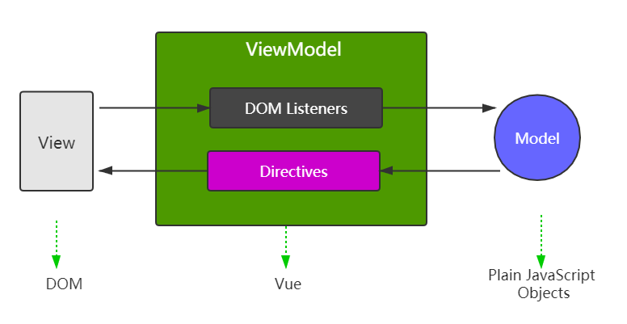
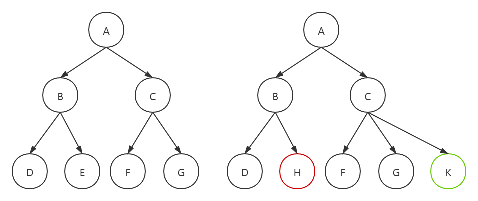
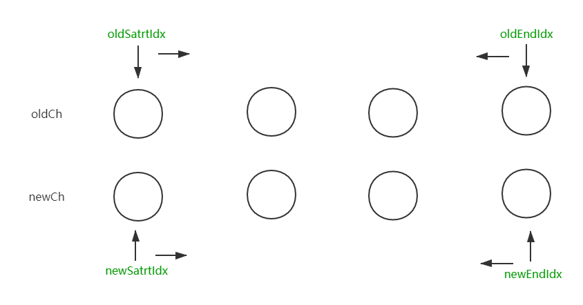

---
title:Vue 原理
---

#### Vue 原理

- 为何要考察原理 ？
  - 知其然知其所以然。
  - 了解原理才能更好应用。（竞争上岗，择优录取）
  - 造轮子的需求。
- 如何考察 ？以何种方式 ？
  - 考察重点而不是细节，掌握好 2/8 原则。
  - 和使用相关的原理，如 vdom，模板渲染。
  - 整体流程是否全面，热门技术的深度。
- Vue 原理的考察范围 ？包括哪些 ？
  - 组件化
  - 响应式
  - vdom 和 diff
  - 模板编译
  - 渲染过程
  - 前端路由

##### 回顾面试题

- vue-show 和 vue-if 的区别
- v-for 中为何要用 key
- vue 组件生命周期（有父子组件的情况）
- vue 组件间通信
- vue 组件渲染和更新的过程
- 双向数据绑定 v-model 的原理


##### 组件化基础

- 组件化由来已久

  - asp, jsp, php 已经有组件化了。
  - nodejs 中也有类似的组件化。
  - 传统组件只能静态渲染，更新还要依赖于操作 DOM。

- 数据驱动视图（MVVM， setState）

  - 不需操作DOM，只需关注数据，业务逻辑。

  

```jsx
// template 部分可以视作 View

<template>
    <div id="app">
       <p @click="changeName">{{name}}</p>
          <ul>
            <li v-for="(item, index) in list" :key="index">
                {{item}}
            </li>
          </ul>
        <button @click="addItem">添加一项</button>
    </div>
</template>

<script>
export default {
    name: 'APP',
    data(){
        return{
            name: 'JSS'
            list: [
                'a',
                'b',
                'c',
            ]
        }
    },

    methods:{
        addItem(){
            this.list.push(`${Date.now()}`);
        },
        changeName(){
            this.name = "RUOK";
        }
    }
}
</script>
```


##### Vue 响应式原理

实现数据驱动视图的第一步，考察 Vue 原理的第一题。组件的 data 一旦发生变化，立即出发视图的更新。 

- 核心 API - Object.defineProperty

- Object.defineProperty 的一些缺点， Vue 3.0 为什么启用 Proxy ？（Proxy 兼容性不好，而且无法 polyfill）

  ``` js
  // example of Object.defineProperty
  
  const data = {};
  let name = "zhangsan";
  
  Object.defineProperty(data, "name", {
      get: function(){
          console.log("getter is running ...");
          return name;
      },
      set: function(newValue){
          console.log("setter is running ...");
          name = newValue;
      }
  });
  
  // test
  
  console.log(data.name);
  data.name = "LuoJiaoShou";
  console.log(data.name);
  
  // console
  getter is running ...
  zhangsan
  setter is running ...
  getter is running ...
  LuoJiaoShou
  ```

  - 监听对象，监听数组的实现。
  - 复杂对象的情况下如何深度监听。
  
  ```js
  // 视图更新函数
  function updateView() {
      console.log("视图更新");
      // other code
  }
  
  // 重新定义数组原型
  const oldArrayProperty = Array.prototype;
  // 创建一个原型为 oldArrayPrototype 的空对象
  const arrProto = Object.create(oldArrayProperty);
  ['push', 'pop', 'shift', 'unshift', 'splice'].forEach( methodName => {
      arrProto[methodName] = function(){
          updateView();
          // 触发视图更新
          oldArrayProperty[methodName].call(this, ...arguments);
      }
  });
  
  function observer(data) {
      // 深度监听对象
      if (!data || typeof data !== 'object') {
          // 只监听对象或者数组
          return;
      }
      
      if(Array.isArray(data)){
          data.__proto__ = arrProto;
      }
      
      // 重新定义各个属性，for in 既可以遍历数组又可以遍历对象
      for (let key in data) {
          defineReactive(data, key, data[key]);
      }
  }
  
  function defineReactive(data, key, value) {
  
      // 深度监听需要递归
      observer(value);
  
      Object.defineProperty(data, key, {
          get: function () {
              console.log("getter" + value.toString());
              return value;
          },
          set: function (newValue) {
              // value 一直在闭包中 此处设置完之后再get 时也有值
              if (newValue !== value) {
                  console.log("setter");
                  value = newValue;
                  updateView();
                  observer(newValue);
              }
          }
      });
  }
  
  const data = {
      name: 'zhangsan',
      age: 20,
      info: {
          address: 'hangzhou',
      }
  }
  
  observer(data);
  
  // test
  data.name = 'WangEr';
  console.log("name: ", data.name);
  data.age  = 18;
  console.log("age ", data.age);
  data.info.address = "KF";
  console.log("address ", data.info.address);
  ```
  
  - Object.defineProperty 的缺点。
  
    - 深度监听需要递归到底，一次性计算量大。（对象层级很深，如何分次监听）
  
    - 无法监听新增/ 删除属性（Vue.set 以及 Vue.delete）
  
    - 无法原生监听数组，需要特殊处理。
  
      
  
    
  
  

##### 虚拟 DOM (Virtual DOM) 和 Diff 算法

- background

  - vdom 是 Vue 和 React 的基石
  - diff 算法是 vdom 中最核心，最关键的部分
  - DOM 操作非常耗时，JS 执行非常快。JQuery 需要自行控制 DOM 操作，需要手动调整操作顺序。Vue 和 React 如何控制 DOM 操作。

- vdom

  - 用 JS 模拟 DOM 结构，计算出最小的变更，然后操作 DOM。

  ```html
  <div id="div1" class="container">
      <p>vdom</p>
      <ul style="font-size: 20px;">
          <li>a</li>
      </ul>
  </div>
  
  <!-- 对应的js 可以使 -->
  
  
  <script>
  vdomObj = {
      tag: 'div',
      attribute:{
          id: 'div1',
          className: 'container',
      },
      children:[
          {
              tag: 'p',
              attribute:{},
              children: 'vdom',
          },
          {
              tag: 'ul',
              attribute:{
                  style: 'font-size: 20px',
              },
              children:[
                  {
                      tag: 'li',
                      attribute:{},
                      children: 'a',
                  }
              ],
          }
      ],
  }
  
  </script>
  ```

- 通过 snabbdom 学习 vdom

  - 简洁强大的 vdom 库，易学易用，Vue也参考了 该工具实现 vdom 和 diff
  - https://github.com/snabbdom/snabbdom


- diff 算法

  - diff 算法是 vdom 中最核心，最关键的部分。日常使用中也能体现出来 （如 key ）, 社区热议，考察重点。

  - 概述

    - diff 即对比，是一个广泛的概念，如 linux 下的 diff 和 git diff 等。 
    - 两个 JS 对象，两棵树也可以做 diff

    

    - 暴力法 时间复杂度为 O(n^3) （??? 待确定），优化后时间复杂度为 O(n)，具体方法为。
      - 只比较同一层级，不跨级比较。
      - tag 不相同，直接删掉重建，不再深度比较。
      - tag 和 key 都相同，认为是相同节点，不再深度比较。

- snabbdom 源码分析，重点关注

  - h 函数

  - vnode 的结构

  - patch 函数

  - sameVnode 函数

  - patchVnode 函数

  - addVnodes removeVnodes 函数

  - updateChildren 函数 ， (key 的重要性)       @todo 画个流程图好了

    

    

- vdom 和 diff 算法总结
  - 总体流程而不是具体细节。
  - vdom 核心概念： h， vnode，patch， diff，key 等。
  - vdom 的意义，数据驱动视图，控制 dom 操作。


##### 模板编译

- background

  - 模板是 vue 日常开发中最常用的部分，但不是 html，有插值，指令，JS表达式，到底是什么 ？面试常通过 组件的渲染和更新过程 来考察。

  

- 前置知识： JS  的 with 语法

  - 改变 { } 内自由变量的查找规则，当做 对象 属性来查找
  - 找不到 对象属性的话会报错
  - with 要慎用，改变了作用域规则，易读性变差

  ```js
  const obj = {a : 100, b: 200}
  
  console.log(obj.a);
  console.log(obj.b);
  console.log(obj.c); // undefined
  
  // 使用with 能改变 {} 内自由变量的查找方式，将 {} 内的自由变量当做 obj 的属性查找
  with(obj){
      console.log(a);
      console.log(b);
      console.log(c); // 报错
  }
  ```


- 编译模板

  - 模板不是 html ，有指令 插值 JS表达式，能实现判断，循环
  - html 是标签语言，只有 JS 才能实现判断，循环（图灵完备）
  - 模板一定是转换成某种 JS 代码，即编译模板。 

  ```js
  // npm install vue-template-compiler --save
  
  const compiler = require('vue-template-compiler');
  
  // Vue 模板编译示例
  // 插值
  const template = `<p>{{message}}</p>`;
  with (this) { return _c('p', [_v(_s(message))]) }
  // this 就是 vm 实例 new Vue({})
  // 类似于 h 函数
  // -c => createElement => vnode
  // -v => createTextVNode
  // _s => toString
  // _l => renderList
  
  
  const template = `<p>{{flag ? message : 'nothing here'}}<p>`;
  with (this) { return _c('p', [_v(_s(flag ? message : 'nothing here'))]) }
  
  
  const template = `<div id="div1" class="box"></div>`;
  with (this) {
      return _c('div', { staticClass: "box", attrs: { "id": "div1" } }, [
          _c('img', { attrs: { "src": imageUrl } })
      ])
  }
  // 编译
  
  const template = `<div><p v-if="flag === a">A</p><p v-else>B</p></div>`;
  with (this) { return _c('div', [(flag === a) ? _c('p', [_v("A")]) : _c('p', [_v("B")])]) }
  
  const template = `<ul><li v-for="item in list" :key="item.id">{{item.title}}</ul>`;
  with (this) {
      return _c('ul', _l((list),
          function (item) { return _c('li', { key: item.id }, [_v(_s(item.title))]) }), 0)
  }
  
  const template = `<button @click="clickHandler">submit</button>`;
  with (this) { return _c('button', { on: { "click": clickHandler } }, [_v("submit")]) }
  
  const template = `<input type="text" v-model="name">`;
  with (this) {
      return _c('input', {
          directives: [{ name: "model", rawName: "v-model", value: (name), expression: "name" }],
          attrs: { "type": "text" },
          domProps: { "value": (name) },
          on: {
              "input": function ($event) {
                  if ($event.target.composing) return;
                  name = $event.target.value
              }
          }
      });
  }
  
  
  const res = compiler.compile(template);
  console.log(res.render);
  
  
  // 可以利用 run code 插件运行，也可以 node vueTemplateCompiler.js 运行
  ```

  - vue template complier 将模板编译成 render 函数，执行 render 函数生成 vnode
  - 基于 vnode 再执行 patch 和 diff 
  - 通常在开发环境下使用 webpack 配合 vue-loader，直接在开发环境下编译模板，生成环境中直接运行 JS 代码，省去编译模板的步骤。

- vue 组件中使用 render 代替 template

  - 有些复杂的情况下不能用 template , 可以考虑用 render 
  - 相比之下，react 一直在使用 render 

  ```js
  Vue.component('heading', {
      render: function(createElement){
          return createElement(
              'h' + this.level,    // h1, h2 ...
              [
                  createElement('a', {
                      attrs: {
                          name: 'headerId',
                          href: '#' + 'headerId'
                      }
                  }, 'this is a tag')
              ]
          );
      }
  });
  
  // could be <h1><a href="#headerId">this is a tag</a></h1>
  ```

- 模板编译的总结

  - with 语法
  - 模板 到 render 函数， 再到 vnode，再到渲染和更新。
  - vue 组件可以用 render 代替 template 


##### Vue组件的渲染和更新

- background
  - 一个组件的渲染到页面，修改 data 触发更新 （数据驱动视图）
  - 背后原理，需要掌握哪些要点 ？
  - 考察对流程了解的全面程度
- 回顾要点
  - 响应式原理:  Object.defineProperty    getters   setters  （数组）
  - 模板编译:  模板到 render 函数，再到 vnode
  - vdom: patch(elem, vnode) 和 patch(vnode, newVnode)
- 初次渲染过程
  - 解析模板为 render 函数（或在开发环境中已完成，vue-loader）
  - 触发响应式，监听 data 属性， getter setter
  - 执行 render 函数，生成 vnode, patch(elem, vnode)
- 更新过程
  - 修改 data， 触发 setter ( getter 在初次渲染的时候就已经被监听了 )
  - 重新执行 render 函数，生成 newVnode
  - patch(vnode, newVnode)


- 异步渲染
  - $nextTick 
  - 汇总 data 的修改，一次性更新视图。
  - 异步渲染的意义，减少 DOM 操作次数，提高性能。


##### 前端路由原理

- background

  - 稍微复杂一些的 SPA 都需要路由
  - vue-router 也是  vue 的全家桶标配之一
  - 属于 “和 日常使用相关联的原理”，面试常考

- vue-router 的路由模式

  - hash

    - 网页 url 的组成部分

      ```js
      // http://www.abc.com:8080/01-hash.html?a=100&b=20#/aaa/bbb
      
      location.protocal // 'http:'
      location.hostname //'www.abc.com'
      location.host //'www.abc.com：8080'
      location.port // ’8080‘
      location.pathname // '01-hash.html'
      location.search // '?a=100&b=20'
      location.hash // '#/aaa/bbb'
      ```

    - hash 变化会触发页面跳转，即浏览器的前进，后退

    - hash  变化不会刷新页面，SPA 必须的特征

    - hash 永远不会提交到 server 端。

      ```html
      <!DOCTYPE html>
      <html lang="en">
      <head>
          <meta charset="UTF-8">
          <meta name="viewport" content="width=device-width, initial-scale=1.0">
          <title>hash router</title>
      </head>
      <body>
          <p> hash test </p>
          <button id="btn"> 修改 hash </button>
      
          <script>
              // hash 变化，包括
              // a.  js 修改 url
              // b. 手动修改 url 的 hash
              // c. 浏览器的前进和后退
              window.onhashchange = (event) => {
                  console.log('old url ', event.oldURL);
                  console.log('new url ', event.newURL);
                  console.log('hash ', location.hash);
              }
      
              // 页面初次加载 获取 hash
               document.addEventListener('DOMContentLoaded', ()=>{
                   console.log('hash ', location.hash);
               });
      
               // js 修改 url
               document.getElementById('btn').addEventListener('click', ()=> {
                  location.href = '#/user';
               })
          </script>
      </body>
      </html>
      ```

      

  - H5 history

    - 用 url 规范的路由，但跳转时不刷新页面（SPA 必须）
    - history.pushState  window.onpopState 

    ```js
    // hash 路由的情况下
    https://github.com/xxx    		  // 刷新页面
    https://github.com/xxx/yyy    	  // 刷新页面
    https://github.com/xxx/yyy/zzz    // 刷新页面
    
    // h5 history 情况下
    https://github.com/xxx    			// 刷新页面
    https://github.com/xxx/yyy    		// 不刷新
    https://github.com/xxx/yyy/zzz    	// 不刷新
    ```

    ```html
    <!DOCTYPE html>
    <html lang="en">
    <head>
        <meta charset="UTF-8">
        <meta name="viewport" content="width=device-width, initial-scale=1.0">
        <title>h5 hsitory</title>
    </head>
    <body>
        <p> h5 hsitory test </p>
        <button id="btn"> 修改 hash </button>
    
        <script>
    
            // 页面初次加载 获取 path
             document.addEventListener('DOMContentLoaded', ()=>{
                 console.log('hash ', location.pathname);
             });
    
             // 使用 pushState 打开新的路由，不会刷新页面
             document.getElementById('btn').addEventListener('click', ()=> {
                const state = {name: 'page1'};
                console.log("切换路由到 page1");
                history.pushState(state, '', 'page1');
             });
    
             // 浏览器的前进和后退
             window.onpopstate = () => {
                 console.log('onpopstate ', event.state, location.pathname);
             }
    
             // 服务端需要做配合，保证前端 以 h5 histogy 进行跳转的这些地址返回同一个页面，
             // 否则浏览器一刷新就找不到地址了
    
        </script>
    </body>
    </html>
    ```

    - 选择， to B 的系统推荐用 hash，简单易用，但是对 url 规范不敏感。to C的系统可考虑用 h5 history, 需要服务端支持。能选择简单的就用简单的，需要衡量成本和收益。

  

  ##### 总结

  - 组件化
    - 组件化的历史
    - 数据驱动视图
    - MVVM
  - 响应式
    - 监听对象，数组
    - Object.defineProperty 的缺点（3 个）
  - vdom 和 diff 
    - 引用背景
    - vnode 结构
    - snabbdom 使用，vnode h patch
  - 模板编译
    - with 语法
    - 模板编译为 render 函数
    - 执行render 函数生成 vdom
  - 渲染过程
    - 初次渲染
    - 更新过程
    - 异步渲染
  - 前端路由
    - hash
    - history
    - 两者对比

  