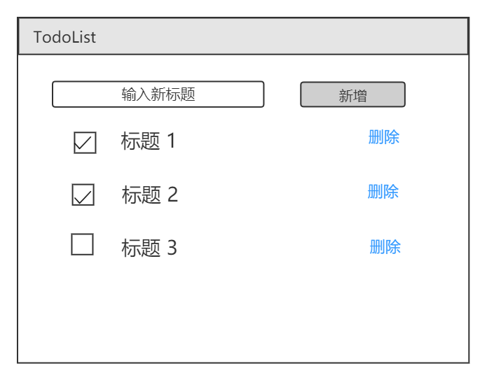
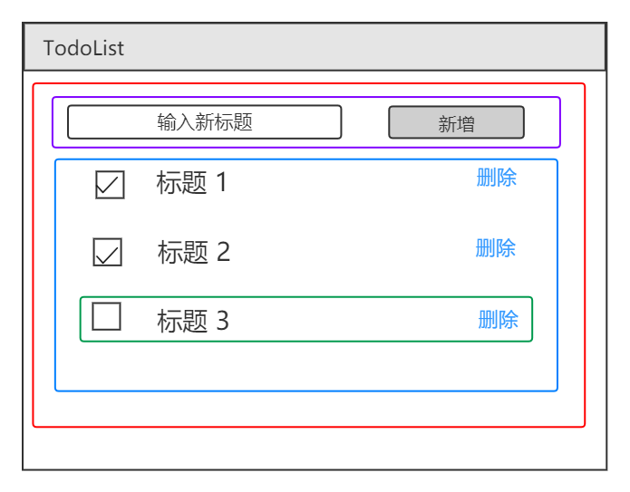
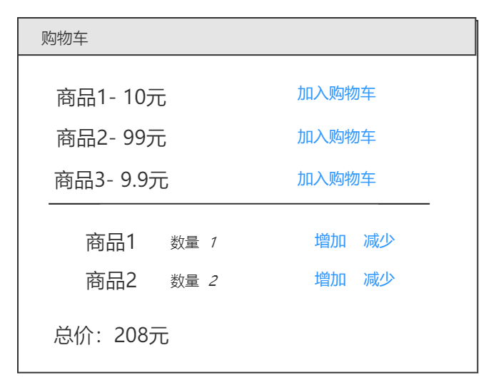
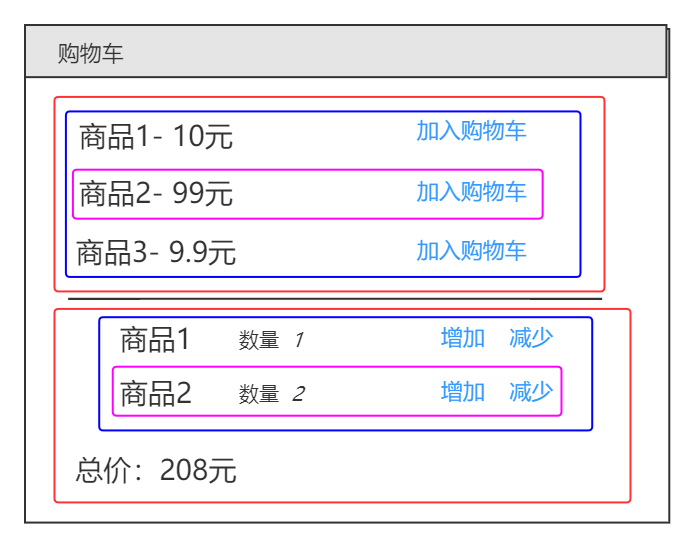

#### 组件和状态设计

---

- background
  - 框架 （Vue  React） 的使用 （和高级特性） 是必备条件
  - 能独立负责项目吗 ？ 还是需要别人带着 ？-- 考察设计能力
  - 面试必考 （二面/三面），场景题
- 考察重点
  - 数据驱动视图
  - 状态： 数据结构设计 （react-state, vue-data）
  - 视图： 组件结构和拆分
- 面试题
  - React 设计 todolist ( 组件结构， redux state 数据结构 )
  - Vue 设计购物车（组件结构，vuex state 数据结构）


---

##### React 实现 Todo List

- state 数据结构设计
- 组件设计 （拆分，组合）和组件通信

- 实现方式：

  - 原型图

    

  - state 数据结构设计

    - 用数据 描述所有内容。
    - 数据要结构化，易于程序操作，如遍历，查找等。
    - 数据要可扩展，以便增加新的功能

    ```js
    this.state = {
        list: [
            {
                id: 1,
                title: '标题1',
                completed: false,
            },
            // ...
        ]
    }
    ```

  - 组件设计

    - 从功能上拆分层级
    - 尽量让组件原子化 （稀疏复杂度）
    - 区分容器组件（只管理数据）和 UI 组件（只显示视图）

    

    ```jsx
    // 组件设计伪代码
    <App><!--只负责管理数据-->
        <Input></Input> <!--只负责输入，将数据结果提交给父组件-->
        <List><!--只负责列表，从父组件获取数据-->
            <ListItem></ListItem><!--负责单条数据的显示，删除，切换完成状态-->
            <ListItem></ListItem>
            <ListItem></ListItem>
        </List>
            
    </App>
    ```

- 代码

- 总结

  - state 数据结构设计
    - 数据描述所有的内容
    - 数据要结构化，易于程序操作（遍历，查找）
    - 数据便于扩展，以便增加新得功能
  - 组件设计 组件通信
    - 从功能上分层
    - 组件原子化
    - 容器组件只管数据，UI 组件只管视图
  - 结合 redux 
    - ... 居然没讲

---

###### Vue 实现购物车

- 原型图

  

- data 数据结构设计

  - 我的答案 / 讲师答案（total 不必有，然后没有库存 stock）

  ```js
  data: {
      // vue 中的data 是这样写的吧，返回一个对象
      return {
          goodsList:[
              {
                  name: '拖鞋',
                  price: 100,
                  id: 'tuoxie89767',
                  stock: 99,
              },
              {
                  name: '短裤',
                  price: 200,
                  id: '短裤89767',
                  stock: 999,
              },
          ],
          shoppingCart:{
              list: [
                  {
                  	id: 'tuoxie89767',
                  	nums: 1,
              	},
                  // 这里不要写 商品的具体信息，易于扩展，如果商品的价格等信息发生变化易于维护
              	{
                  	id: 'duanku89767',
                  	nums: 2,
              	},
              ],
              totol: 0,
              // 这个不必有，可以算出来，而且vue 里面还有 computed 
          }
      }
  }
  ```

  - 数据描述所有的内容；要结构化，便于程序操作（遍历，查找）；可扩展，以便增加新的功能

- 组件设计

  - 从功能上拆分层次；尽量让组件原子化；容器组件管数据，UI组件管视图

  

     ```jsx
<App>
    <ProductionList>
        <Product></Product>
        <Product></Product>
        <Product></Product>
    </ProductionList>
    <Cart>
        <CartItem></CartItem>
        <CartItem></CartItem>
    </Cart>
</App>
     ```

- 使用 vuex 的 购物车 demo 
  - vuex 官网的 github  有代码，可以学习。

