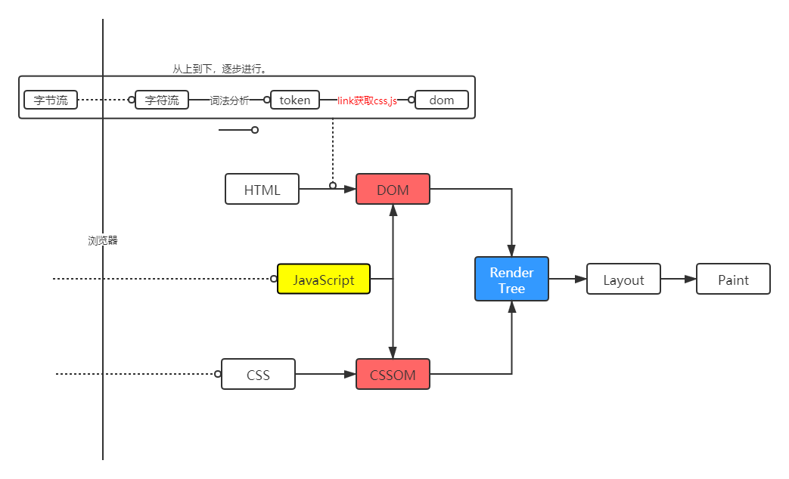

##### http 请求相关的优化

- background

  - 课程目标
    - 理解 减少 http 请求数量和减少请求资源大小两个优化要点
    - 掌握资源合并和压缩原理
    - 掌握通过在线网站和 fis3 两种实现压缩与合并的方法
  - B/S 系统
    - 浏览器发起 http 请求拿到资源解析后呈现
    - 浏览器的一个请求从发送到返回都经历了什么 ？

- http 请求过程中的优化点

  - 通过 dns 缓存减少 dns 查询时间
  - 网络请求的过程走最近的路径
  - 相同的静态资源做缓存
  - 减少 http 请求的大小
  - 减少 http 请求
  - 服务端渲染 SSR

- 资源的合并和压缩 && 减少请求资源的大小

  - 减少 http 请求的个数 && 减少 response 的文件大小

    - html 压缩

      压缩文本文件，删除空格，制表符，换行，注释等等。具体方式可以有：

      - 使用在线网站进行压缩。
      - nodejs 提供了 html-minifier 工具，需要配置参数。
      - 后端模板引擎压缩渲染。

    - css 压缩

      - 无效代码删除
      - css 语义合并
      - 使用在线网站，html-minifier工具对 html中的css 压缩，使用clean-css 对css 压缩。

    - js 的压缩和混乱

      - 无效字符的删除
      - 剔除注释
      - 代码语义缩减和优化，如webpack 的打包结果
      - 代码保护（压缩之后不易于阅读，一方面也能保护网站的业务逻辑）
      - 使用在线网站压缩，使用 html-minifier 对 html 中的 js代码压缩，使用uglifyjs对 js 代码进行压缩 （结合构建工具，webpack 等去用） 

    - 文件合并

      - 劣势
        - 首屏渲染可能变慢
        - 缓存失效问题。任意一个文件的改动都会导致 合并后的文件 缓存失效。
      - 优势
        - 减少多个网络请求之间的延迟
      - 建议
        - 公共库合并
        - 不同页面的合并，对于 SPA，不同页面的组件分别打包
      - 实现
        - 在线网站
        - 使用 nodejs 实现文件合并
        - 打包工具，webpack

    - 开启 gzip

- 总结

  - http 请求过程的各个步骤都是潜在的性能优化的点
  - 压缩与合并的基本理念和灵活使用

##### 图片相关的优化

- background
  - 课程目标
    - 理解图片优化相关的核心概念
    - 结合 facebook 和 淘宝移动首页案例分析
    - 掌握通过 在线网站 和 fis3 实现图片相关的一些优化
    
  - 核心概念
    - 有损压缩，如 jpg，压缩率高，不支持透明
    - 无损压缩
    - png8/png24/png32 的区别，png8 256色，支持透明。png24 2^24色，不支持透明。 png32 2^24色，支持透明。png 支持透明，浏览器兼容性好。
    - webp 压缩程度更好，在 ios webview 有兼容性问题。
    - svg 矢量图，代码内嵌，相对较小，适用于图片样式相对简单的场景。
    
  - 不同格式图片的应用场景
    - jpg -大部分不需要透明图片的业务场景
    - png - 大部分需要透明图片的业务场景
    - webp - 安卓全部
      - 更高级的图像数据压缩算法，能带来更小的图片体积，拥有肉眼识别无差异的图像质量。同时具备有损和无损压缩模式，Alpha 透明以及动画的特性，在JPEG 和 PNG 上的转化效果都非常优秀，稳定，统一。
    - svg矢量图 - 图片样式相对简单的业务场景，icon, logo 之类的
    
  - css 雪碧图
  
    - 将多个图片整合到单独的图片中，减少 http 请求数量。
    - 缺点，把鸡蛋放到一个篮子里，页面加载可能有风险。而且整合后的图片较大的话加载慢，可以考虑放到多个篮子里面，也就是多张雪碧图，比如所将同一个页面内的 icon 放到一张雪碧图上。
  
  - Image inline
  
    - 将图片的内容内嵌到 html 中，如 base64格式，减少 http 请求数量。如 0.1kb 的图片，额外的 http 请求耗时是不值得的。而且 base64的编码格式其实会增加总的数据量，但是能减少 http请求，所以对于小的 icon 还是划算的。
  
  - 使用矢量图
  
    - iconfont
  
  - 实战
  
    - iconfont  https://www.iconfont.cn/ 
    - png/jpg 压缩 https://tinypng.com
    - 雪碧图 www.spritecow.com  可以计算 background-position
  
    
  
     

##### html css js 的加载过程

- background

  - 课程目标
    - 理解浏览器端 html，css，js 的加载过程
    - 结合 chrome 学习掌握 css js 加载过程中的优化点
    - 通过案例分析和实战演练深入理解学习的优化点
  - 引子
    - 一个网站在浏览器端是如何进行渲染的 ？

  

- html 渲染过程的一些特点
  - 顺序执行，并发加载（引入 css, js等资源，并发度受浏览器域名限制，设置多个 cdn域名，增加并发请求的数量）
  - 是否阻塞，（css 的加载是否会 阻塞 html 的渲染，css 的加载是否会阻塞 js 的执行）
  - 依赖关系， 渲染过程中的文件是否有依赖关系，如何保证正确，如何优化。比如说，有些页面会在 css 未加载完的时候显示空白，这种情况下可以将 css 文件link 放在header中，浏览器会等到 css 加载，cssom, render Tree 之后才会渲染。 JS 的执行顺序，如 async，能够让js 不阻塞渲染，但是放弃了 js 文件之间的依赖关系，哪个先加载完就执行哪个。
  - 引入方式，link or import ? 
    - js
      - script
      - defer async ?
      - 动态引入

