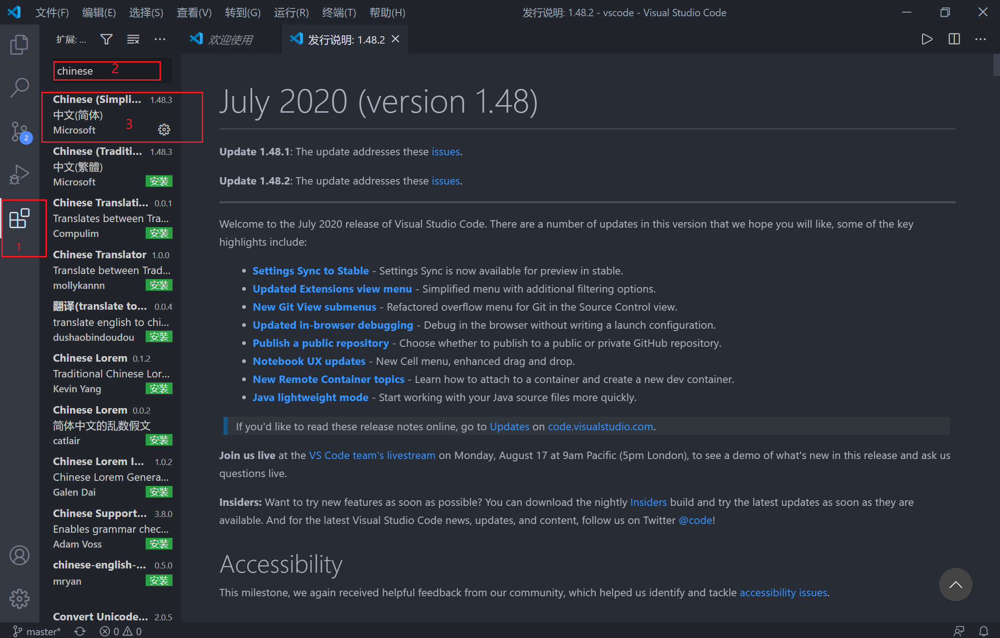
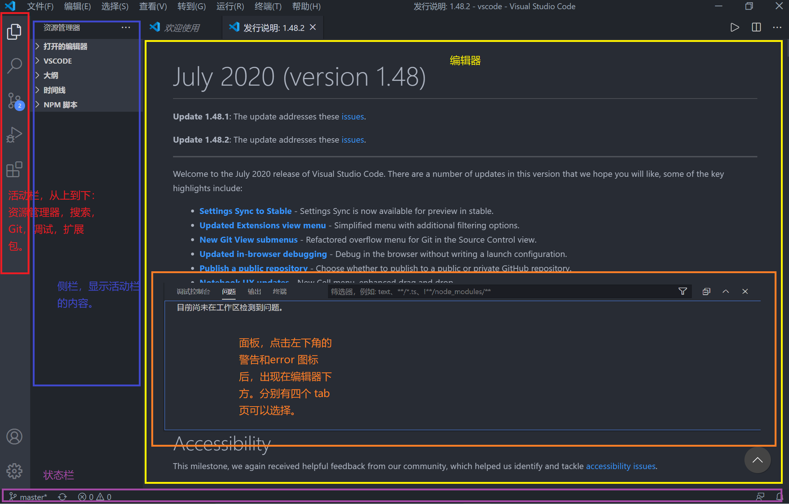
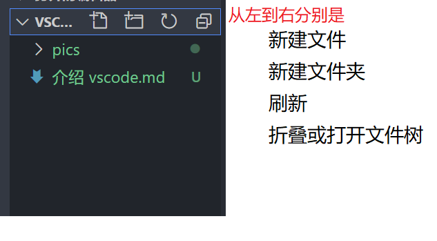
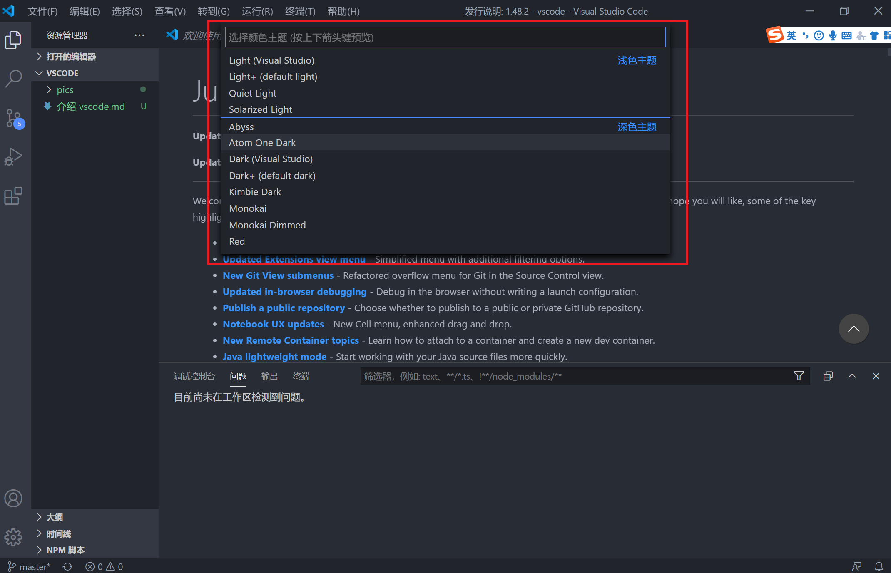
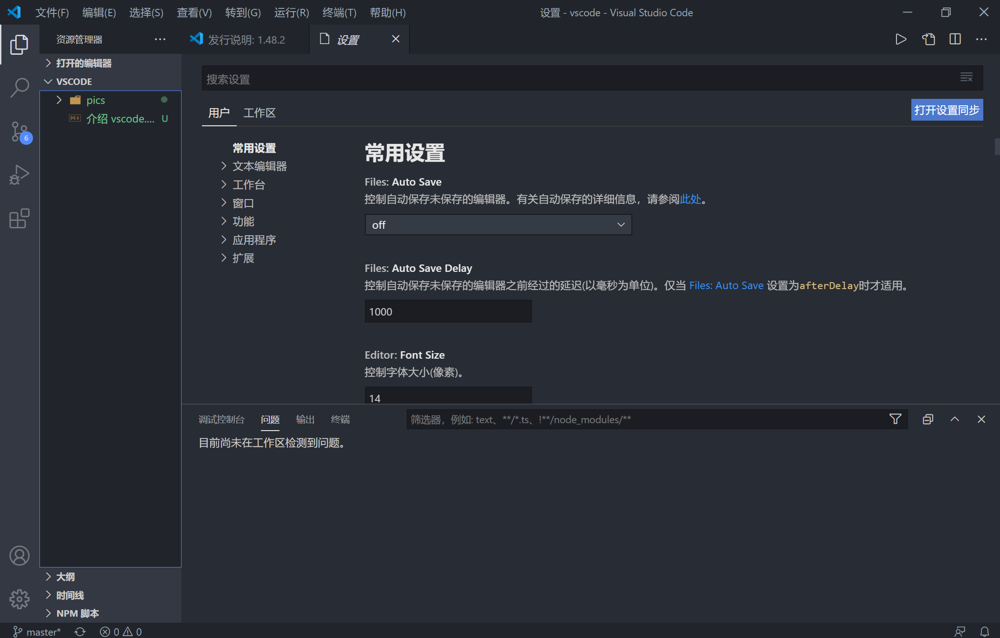
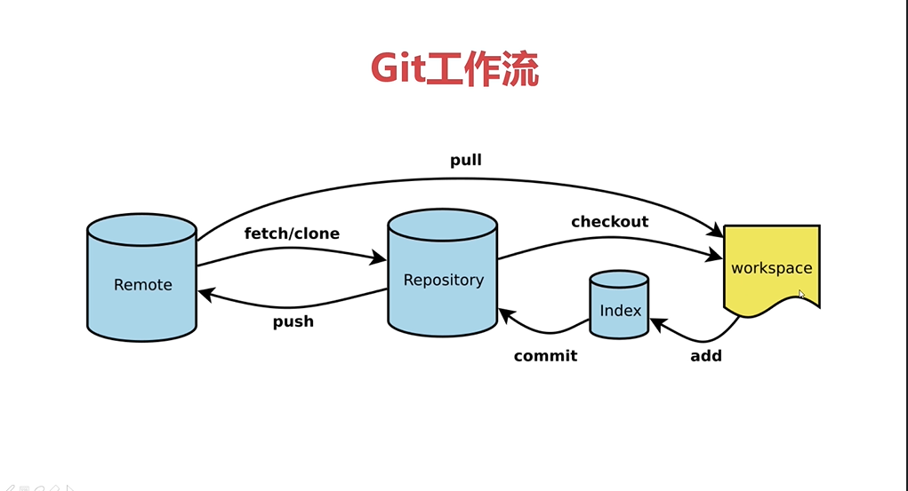
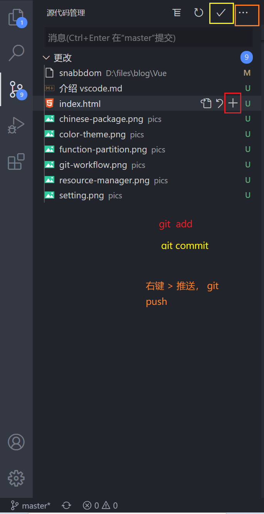

##### vscode 是什么

- 免费，开源，高性能，跨平台，轻量级的代码编辑器。

##### 优点

- 免费，开源
- 海量的扩展插件
- 轻量（不会占用大量的内存和CPU）

##### 文章内容

- 用户配置（界面，主题，快捷键等）
- Git 配置（Git 下载，安装，使用）
- 扩展插件的安装和使用

##### vscode 的下载与安装

 https://code.visualstudio.com/ 


##### 汉化

1. 点击侧边栏的 扩展 icon
2. 在搜索框中输入 Chinese
3. 点击第一个中文简体语言包并安装
4. 重启 vscode




##### 基本布局

- 活动栏
- 侧栏
- 编辑器
- 面板
- 状态栏




##### 项目的新建和打开

1. 新建一个文件夹

2. vscode 打开文件夹

   

   

   

- 注意事项
  - 新建文件需添加后缀名
  - 新建文件夹需要选择好新建的文件目录


##### 主题设置

- 颜色主题

  1. 文件 > 首选项 > 颜色主题
  2. 快捷键 ctrl + k, ctrl + t
  3. 查看 > 命令面板 > 输入 theme
  4. 快捷键 ctrl + shift + p 进入命令面板，输入 theme

  

- 下载并安装扩展颜色主题

  - 在扩展中搜索并安装后再次设置颜色主题即可

  

- 图标主题

  - 设置，安装与颜色主题相似，不做过多描述。搜索时可以输入 icon，不支持中文搜索。

##### 用户和工作区设置

- 用户设置是**全局**应用于您打开的任何 VS 代码实例的设置。
- 工作区设置是存储在工作区内的设置，仅在打开工作区时应用。工作区设置优先级高于用户设置。

文件 > 首选项 > 设置



- 需要设置的点

  - 常用设置 > 控制折行的方式

  - 常用设置 > Tab size 一个tab 等于的空格数

    

常用快捷键

- 复制粘贴，ctrl + c, ctrl + v
- 整行复制粘贴，无需选中内容，光标在行内任意位置，ctrl + c, ctrl + v 即可。
- 查找， ctrl + f， 按 f3查找下一个。光标在输入框的时候，回车即可查找下一个。
- **替换， ctrl + h**
- 保存， ctrl + s
- 行注释， ctrl + /
- **块注释，选中, shift + alt + a**
- 上方复制粘贴一行， alt+ shift + 上方向键
- 下方赋值粘贴一行，alt+ shift + 下方向键
- **插入到下一行（光标跳转） ctrl + enter**
- 文件夹查找，ctrl + shift + f  (活动栏的搜索而已，不记得也可以)
- 格式化代码， alt + shift + f  （右键格式化代码的快捷方式）
- 快捷键映射，将其他编辑器的快捷键映射到 vscode 上，例如 sublime txt, atom。设置方式为，文件 > 首选项 > 键映射。 自定义快捷键， 文件 > 首选项 > 键盘快捷方式
- 多行编辑， 按住 alt，鼠标点击不同的位置


---


##### Git

- 什么是 Git ?
  - 开源的分布式版本控制系统，可以有效，高速地处理从很小到很大的项目版本管理。



Remote 为远程仓库， Repository 是本地仓库，checkout 切换到特定分支。经常 pull 可以在一定程度上避免代码冲突。

- 下载和安装

  - https://gitforwindows.org/ 

- github

  - 面向开源以及私有的软件项目的托管平台
  - 利用 github 创建一个远程仓库（注册账号，创建仓库等等）

- GIt 基本操作

  - 配置用户名和邮箱

    ```bash
    // 打开 git bash
    git config --global user.name "sunjs"
    git config --global user.email "sunjs@163.com"
    ```

  - 克隆仓库

    `git clone 'repository address'`

  - 使用 vscode 打开仓库所在的文件夹

  - 编辑代码

  - `git add .` 添加全部修改 或者 `git add index.js` 添加指定文件的修改

  - git commit -m "description message" 提交全部修改到本地仓库，或者 `git commit index.js` 提到单个文件修改到本地仓库

  - `git push` 提交本地仓库到远程仓库（可能需要输入账号密码）

  - `git pull`  拉取远程修改到本地 




##### 常用插件推荐

- CSS Peek: html 与 css 关联，ctrl 显示html 元素样式，ctrl + 单击跳转到样式定义。安装后重启 vscode 生效。（推荐）
- Prettier ： 代码格式化
- Icon Fonts ： 图标集，如 Font Awesome, Glyphicons , 图标集元素名称自动补齐。
- Auto Rename Tag: 自动重命名标签，修改开始标签，自动修改结束标签。（推荐）
- HTML Boilerplate : HTML 模板，自定义模板
- color info： 颜色提示，显示颜色的各种格式，color picker
- Auto close Tag: 自动闭合标签
- HTML CSS Support : HTML 中 css class 智能提示，提示已经引入的样式表中的类名或 ID

##### 引用

- [vscode 使用教程]( https://www.imooc.com/video/18975 )